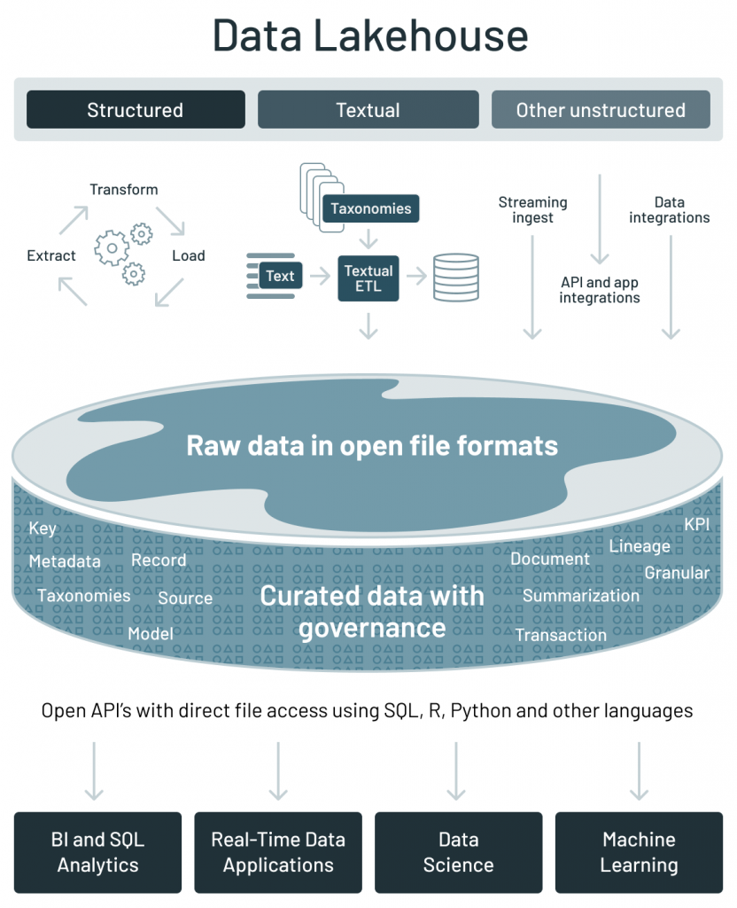

## Big data and cloud platforms (module 2)

#### From databases to data platforms

---

## How did we get here?

**Data-Driven Innovation**
- Use of data and analytics to foster new products, processes and markets
- Drive discovery and execution of innovation, achieving new services with a business value

**Analytics**
- A catch-all term for different business intelligence (BI)- and application-related initiatives
  - E.g., of analyzing information from a particular domain
  - E.g., applying BI capabilities to a specific content area (e.g., sales, service, supply chain)

**Advanced** Analytics
- (Semi-)Autonomous examination of data to discover deeper insights, make predictions, or generate recommendations (e.g., through data/text mining and machine learning)

**Augmented** Analytics
- Use of technologies such as machine learning and AI to assist with data preparation, insight generation and insight explanation to augment how people explore and analyze data

---

---

## Data platform

Companies are collecting tons of data to enable advanced analytics
- Raw data is difficult to obtain, interpret, and maintain 
- Data is more and more heterogeneous
- There is need for curating data to make it consumable

Where are we collecting/processing data?
- Getting value from data is not (only) a matter of storage
- Need integrated and multilevel analytical skills and techniques

---

Getting **value** from data **is not** (only) a matter of **storage**
- Any example?

> "It is a capital mistake to theorize before one has data. Insensibly, one begins to twist the facts to suit theories, instead of theories to suit facts." Sherlock Holmes 

---

## Case study: photo gallery

---

## Data platform

Database
> "A **database** is a **structured** and **persistent** collection of information about some aspect of the real world organized and stored in a way that facilitates efficient retrieval and modification. The **structure** of a database is determined by an abstract **data model**. Primarily, it is this structure that differentiates a database from a data file."

Özsu M.T. (2018) Database. In: Encyclopedia of Database Systems. Springer, New York, NY. <a href="https://doi.org/10.1007/978-1-4614-8265-9_80734" target="_blank">(doi)</a>

---

The **relational model**
- Manage data using a structure and language consistent with first-order predicate logic
- Described in 1969 by English computer scientist Edgar Codd
- Data is represented in terms of tuples, grouped into relations

 

---

**Data Warehouse**
> "A collection of data that supports decision-making processes. It provides the following features: subject-oriented, integrated and consistent, not volatile."

- Reduce stress on operational systems
- Integrate data sources
- No IT involvement to create reports
- One version of the truth
- Make better business decisions

Matteo Golfarelli and Stefano Rizzi. Data warehouse design: Modern principles and methodologies. McGraw-Hill, Inc., 2009.

---

## OLTP vs OLAP

### ?
---

## OLTP vs OLAP

|      Characteristic         |                              OLTP                             |                        OLAP                      |
|:---------------------------:|:-------------------------------------------------------------:|:------------------------------------------------:|
|    **Nature**               |            Constant   transactions (queries/updates)          |     Periodic   large updates, complex queries    |
|    **Examples**             |        Accounting   database, online retail transactions      |           Reporting,   decision support          |
|    **Type**                 |                       Operational   data                      |                Consolidated   data               |
|    **Data retention**       |                     Short-term (2-6 months)                   |               Long-term (2-5 years)              |
|    **Storage**              |                         Gigabytes (GB)                        |          Terabytes (TB) / Petabytes (PB)         |
|    **Users**                |                              Many                             |                        Few                       |
|    **Protection**           |     Robust,   constant data protection and fault tolerance    |               Periodic   protection              |

---

 

---

Data lake
> "A DL is a **central repository** system for storage, processing, and analysis of raw data, in which the data is kept in its **original format** and is processed to be **queried only when needed**. It can store a varied amount of formats in big data ecosystems, from unstructured, semi-structured, to structured data sources"

Couto, Julia, et al. "A Mapping Study about Data Lakes: An Improved Definition and Possible Architectures." SEKE. 2019.
<a href="https://dunnsolutions.com/business-analytics/big-data-analytics/data-lake-consulting" target="_blank">(link)</a>

---

 

---

 

---

## DWH vs Data Lake
### ?

---

## DWH vs Data Lake

|         Characteristics        |                                  Data warehouse                                |                                        Data lake                                      |
|:------------------------------:|:------------------------------------------------------------------------------:|:-------------------------------------------------------------------------------------:|
|               **Data**             |                                    Relational                                  |                              Non-relational and relational                            |
|              **Schema**            |               Designed   prior to implementation (schema-on-write)             |                Written   at the time of analysis       (schema-on-read)               |
|     **Price/performance**    |                Fastest   query results using higher cost storage               |               Query   results getting faster using       low-cost storage             |
|          **Data quality**        |     Highly curated data   that serves as the central   version of the truth    |              Any data, which may or may not be curated   (e.g., raw data)             |
|              **Users**             |                                Business analysts                               |     Data scientists, data developers, and business   analysts (using curated data)    |
|            **Analytics**           |                     Batch reporting, BI, and visualizations                    |        Machine learning,   predictive analytics, data discovery, and profiling.       |
|                                |                                                                                |                                                                                       |

--- 

## Data lake

Data lakes have increasingly taken the role of data hubs
- Eliminate up-front costs of ingestion and ETL since data are stored in original format
- Once in DL, data are available for analysis by everyone in the organization

Drawing a sharp line been storage/computation/analysis is hard
- Is a database just storage?
- What about SQL/OLAP?

Blurring of the architectural borderlines
- DL is often replaced by “data platform” or “data ecosystem”
- Encompass systems supporting data-intensive storage, computation, analysis

---

## Data platform

Data platform 
> An integrated set of technologies that collectively meets an organization’s end-to-end data needs such as acquisition, storage, preparation, delivery, and governance, as well as a security layer for users and applications

Rationale: relieve users from complexity of administration and provision
  - Not only technological skills, but also privacy, access control, etc.
  - Users should only focus on functional aspects

Are we done? No!
- Lacking smart support to govern the complexity of data and transformations
- Data transformations must be governed to prevent DP turning into a swamp
  - Amplified in data science, with data scientists prevailing data architects
  - Leverage descriptive metadata and maintenance to keep control over data

---

## Managing data platforms

#### Which functionalities for (automated) data management can you think about?

--- 

## Managing data platforms

- Data provenance
- Compression
- Data profiling
- Entity resolution
- Data versioning
- ...

---

## Data provenance

Provenance (also referred to as lineage, pedigree, parentage, genealogy) 
- The description of the origins of data and the process by which it arrived at the database
- Not only data products (e.g., tables, files), but also the processes that created them

Use cases
- Business domain
  - Users traditionally work with an **organized data schema**, where the structure and **semantics of the data in use is shared** across the corporation. Yet, **sources** of bad data **need to be identified** and corrected to avoid costly errors
- Scientific/research domain
  - **Data** used in the scientific field can be **ad hoc** and driven by individual researchers or small communities. The scientific field is **moving towards more collaborative research** and organizational boundaries are disappearing. **Sharing data and metadata across organizations is essential**, leading to a convergence on common schemes to ensure compatibility. Issues of **trust, quality, and copyright** of data are significant

Simmhan, Yogesh L., Beth Plale, and Dennis Gannon. "A survey of data provenance techniques." Computer Science Department, Indiana University, Bloomington IN 47405 (2005): 69.

---

## Data provenance

Astronomers are creating an international Virtual Observatory 
- A **federation** of all the world significant astronomical **data resources** coupled with **provision of the computational resources** needed to exploit the data - scientifically
- Astronomy changed from being an individualistic to a **collective enterprise**
- Telescope time is devoted/allocated to systematic sky surveys and analysis is performed using data from the archives
- Astronomers are **increasingly relying on data that they did not take themselves**
- Raw data bear **many instrumental signatures that must be removed** in the process of generating data products

Mann, Bob. "Some data derivation and provenance issues in astronomy." Workshop on Data Derivation and Provenance, Chicago. 2002.
<a href="https://www.esa.int/Science_Exploration/Space_Science/Webb/Webb_inspects_the_heart_of_the_Phantom_Galaxy" target="_blank">(link; accessed 2022-08-01)</a>

---

## Data provenance

 

Simmhan, Yogesh L., Beth Plale, and Dennis Gannon. "A survey of data provenance techniques." Computer Science Department, Indiana University, Bloomington IN 47405 (2005): 69.

---

## Data provenance

Granularity
- **Fine-grained** (instance level): tracking data items (e.g., a tuple in a dataset) transformations
- **Coarse-grained** (schema-level): tracking dataset transformations

Queries
- **Where** provenance: given some output, which inputs did the output come from?
- **How** provenance: given some output, how were the inputs manipulated?
- **Why** provenance: given some output, why was data generated? 
  - E.g., in the form of a proof tree that locates source data items contributing to its creation

Simmhan, Yogesh L., Beth Plale, and Dennis Gannon. "A survey of data provenance techniques." Computer Science Department, Indiana University, Bloomington IN 47405 (2005): 69.
 
Ikeda, Robert, and Jennifer Widom. Data lineage: A survey. Stanford InfoLab, 2009.

---

## Data provenance

Data provenance, an example of data management
- Metadata pertaining to the history of a data item
- Pipeline including the origin of objects and operations they are subjected to
- We have a standard: https://www.w3.org/TR/prov-dm/

 

---

## `prov-dm`
**Entity**: physical/conceptual things

**Activity**: dynamic aspects of the world, such as actions
- How entities come into existence, often making use of previously existing entities

**Agent**: a person, a piece of software
- Takes a role in an activity s.t. the agent can be assigned some degree of responsibility 

 

<a href="https://www.w3.org/TR/2013/NOTE-prov-primer-20130430/" target="_blank">https://www.w3.org/TR/2013/NOTE-prov-primer-20130430/</a>

---

## Data provenance

Use cases
  - Accountability and auditing
  - Data quality
    - Monitoring of the quality (e.g., accuracy) of the objects produced
    - Notify when a transformation pipeline is not behaving as expected
  - Debugging
    - Inferring the cause of pipeline failures is challenging
    - Store inputs of each operation with versions and environmental settings (RAM, CPUs)
  - ...

---

## Compression

Summarization / compression
- Present a concise representation of a dataset in a comprehensible and informative manner

 

Ahmed, Mohiuddin. "Data summarization: a survey." Knowledge and Information Systems 58.2 (2019): 249-273.

---

## Data profiling

Data profiling 
- A broad range of methods to efficiently analyze a given data set
- E.g., in a relational scenario, tables of a relational database are scanned to derive metadata, such as data types and value patterns, completeness and uniqueness of columns, keys and foreign keys, and occasionally functional dependencies and association rules

---

## Data profiling

 

Naumann, Felix. "Data profiling revisited." ACM SIGMOD Record 42.4 (2014): 40-49.

---

## Data profiling

Use cases
- Query optimization
  - Performed by DBMS to support query optimization with statistics about tables and columns
  - Profiling results can be used to estimate the selectivity of operators and the cost of a query plan
- Data cleansing (typical use case is profiling data)
  - Prepare a cleansing process by revealing errors (e.g., in formatting), missing values or outliers
  - Data integration and analytics

Challenges?

---

## Data profiling

Challenges
- The results of data profiling are computationally complex to discover
  - E.g., discovering keys/dependencies usually involves some sorting step for each considered column
- Verification of complex constraints on column combinations in a database
  - What is the complexity of this task?

---

## Data profiling

|     a    |     b    |     c    |     d    |
|----------|----------|----------|----------|
|     1    |     1    |     2    |     2    |
|     1    |     2    |     1    |     4    |

Given the above table with schema `$C=\{a,b,c,d\}$`

- To extract the (distinct) cardinality of each column, consider `$|C|$` columns `$(a), (b), (c), (d)$`
- To extract the correlations between pairs of columns, consider `$\binom{|C|}{2}$` groups
`$(a, b), (a, c), (a, d), (b, c), (c, d), (c, d)$`
- Extracting the relationships among all possible groups of columns generalizes to `$\sum_{n=1}^{|𝐶|}\binom{|C|}{n} =2^{|C|}−1$` groups

---

## Entity resolution

Entity resolution, also known as entity matching, linking
- Find records that refer to the same entity across different data sources (e.g., data files, books, websites, and databases)

 

Papadakis, George, et al. "Blocking and filtering techniques for entity resolution: A survey." ACM Computing Surveys (CSUR) 53.2 (2020): 1-42.

---

## Data versioning

Version control 
- Managing changes to computer programs, documents, or data collections
- Changes are identified by a number/letter code, termed the revision/version number

However, data pipelines are not only about code bult also about
- Model Version Control
- Data Version Control
- Model Parameter Tracking
- Model Performance Comparison

 

---

## Data versioning

Support CRUD \(Create\, Read\, Update\, Delete\) operations with versions

E\.g\.\, on AWS \(PUT\, GET\, DELETE\)\, what about update?

[https://docs\.aws\.amazon\.com/AmazonS3/latest/userguide/versioning\-workflows\.html](https://docs.aws.amazon.com/AmazonS3/latest/userguide/versioning-workflows.html) \(accessed 2022\-08\-01\)

---

## In action

Lab: California housing prices

---

## Data platform

* Are we done? No\!
  * Metadata can become bigger than data themselves
* We need meta meta\-data \(or models\)\.\.\.
  * \.\.\. chasing our own tails
* Data management is still a \(research\) issue in data platforms

---

## Data lakehouse

* __Data lakehouse__
  * Data management architecture that combines the flexibility\, cost\-efficiency\, and scale of data lakes with the data management and ACID transactions of data warehouses\, enabling business intelligence \(BI\) and machine learning \(ML\) on all data
  * Vendor lock in

[https://www\.databricks\.com/glossary/data\-lakehouse](https://www.databricks.com/glossary/data-lakehouse)

|  | Data warehouse | Data lake | Data lakehouse |
| :-: | :-: | :-: | :-: |
| Data format | Closed, proprietary format | Open format (e.g., Parquet) | Open format |
| Types of data | Structured data, with limited support for semi-structured data | All types: Structured data, semi-structured data, textual data, unstructured (raw) data | All types: Structured data, semi-structured data, textual data, unstructured (raw) data |
| Data access | SQL-only, no direct access to file | Open APIs for direct access to files with SQL, R, Python and other languages | Open APIs for direct access to files with SQL, R, Python and other languages |
| Reliability | High quality, reliable data with ACID transactions | Low quality, data swamp | High quality, reliable data with ACID transactions |
| Governance and security | Fine-grained security and governance for row/columnar level for tables | Poor governance as security needs to be applied to files | Fine-grained security and governance for row/columnar level for tables |
| Performance | High | Low | High |
| Scalability | Scaling becomes exponentially more expensive | Scales to hold any amount of data at low cost, regardless of type | Scales to hold any amount of data at low cost, regardless of type |
| Use case support | Limited to BI, SQL applications and decision support | Limited to machine learning | One data architecture for BI, SQL and machine learning |

* Key technologies used to implement open source Data Lakehouses
  * Databricks’ Delta Lake
  * Apache Hudi
  * Apache Iceberg

[https://databricks\.com/blog/2021/05/19/evolution\-to\-the\-data\-lakehouse\.html](https://databricks.com/blog/2021/05/19/evolution-to-the-data-lakehouse.html)

---

## Data fabric

* Frictionless access and sharing of data in a distributed data environment
  * Enables  __a single and consistent data management framework__ \, which allows seamless data access and processing by design across otherwise siloed storage
  * Leverages  __human and machine capabilities __ to access data in place or support its consolidation where appropriate
  * __Continuously__  identifies and connects data from disparate applications to discover unique\, business\-relevant relationships between the available data points
* It is a unified architecture with an integrated set of technologies and services
  * Designed to deliver  __integrated and enriched data __ – at the right time\, in the right method\, and to the right data consumer – in support of both operational and analytical workloads
  * Combines key data management technologies – such as data catalog\, data governance\, data integration\, data pipelining\, and data orchestration

Gartner\, 2019 [https://www\.gartner\.com/en/newsroom/press\-releases/2019\-02\-18\-gartner\-identifies\-top\-10\-data\-and\-analytics\-technolo](https://www.gartner.com/en/newsroom/press-releases/2019-02-18-gartner-identifies-top-10-data-and-analytics-technolo) Gartner\, 2021 [https://www\.gartner\.com/smarterwithgartner/data\-fabric\-architecture\-is\-key\-to\-modernizing\-data\-management\-and\-integration](https://www.gartner.com/smarterwithgartner/data-fabric-architecture-is-key-to-modernizing-data-management-and-integration) K2View Whitepaper: What is a Data Fabric? The Complete Guide\, 2021

[https://www\.irion\-edm\.com/data\-management\-insights/gartner\-data\-summit\-irion\-representative\-vendor\-for\-data\-fabric\-technology/](https://www.irion-edm.com/data-management-insights/gartner-data-summit-irion-representative-vendor-for-data-fabric-technology/)

Gartner\, 2021 [https://www\.gartner\.com/smarterwithgartner/data\-fabric\-architecture\-is\-key\-to\-modernizing\-data\-management\-and\-integration](https://www.gartner.com/smarterwithgartner/data-fabric-architecture-is-key-to-modernizing-data-management-and-integration)

---

## Data mesh

* Distributed data architecture\, under centralized governance and standardization for interoperability\, enabled by a shared and harmonized self\-serve data infrastructure
  * Domain\-oriented decentralized data ownership
    * Decentralization and distribution of responsibility to people who are closest to the data\, in order to support continuous change and scalability
    * Each domain exposes its own op/analytical APIs
  * Data as a product \( _quantum_ \)
    * Products must be discoverable\, addressable\, trustworthy\, self\-describing\, secure
  * Self\-serve data infrastructure as a platform
    * High\-level abstraction of infrastructure to provision and manage the lifecycle of data products
  * Federated computational governance
    * A governance model that embraces decentralization and domain self\-sovereignty\, interoperability through global standardization\, a dynamic topology\, automated execution of decisions by the platform

Zhamak Dehghani\, 2019 [https://martinfowler\.com/articles/data\-monolith\-to\-mesh\.html](https://martinfowler.com/articles/data-monolith-to-mesh.html)Zhamak Dehghani\, 2020 [https://martinfowler\.com/articles/data\-mesh\-principles\.html](https://martinfowler.com/articles/data-mesh-principles.html)

---

## Data mesh vs data fabric

* A data fabric and a data mesh both provide an architectural framework to access data across multiple technologies and platforms
  * Data fabric
    * Attempts to centralize and coordinate data management
    * Tackles the complexity of data and metadata in a smart way that works well together
  * Data mesh
    * Emphasis on decentralization and data domain autonomy
    * Focuses on organizational change; it is more about people and process
* They are design concepts\, not things
  * They are  _not_  mutually exclusive
  * They are architectural frameworks\, not architectures
    * The frameworks must be adapted and customized to your needs\, data\, processes\, and terminology
    * Gartner estimates 25% of data management vendors will provide a complete data fabric solution by 2024 – up from 5% today

Alex Woodie\, 2021 [https://www\.datanami\.com/2021/10/25/data\-mesh\-vs\-data\-fabric\-understanding\-the\-differences/](https://www.datanami.com/2021/10/25/data-mesh-vs-data-fabric-understanding-the-differences/) Dave Wells\, 2021 [https://www\.eckerson\.com/articles/data\-architecture\-complex\-vs\-complicated](https://www.eckerson.com/articles/data-architecture-complex-vs-complicated)

---

## Example of data platform: Hadoop-based

A data platform on the Hadoop stack requires several tools

* How many levels of complexity are hidden here?
* How do you provision it?
  * Manual provisioning on\-premises
  * Semi\-automatic provisioning on\-premises
  * Automatic provisioning in the cloud
  
---

## On-premises manual provisioning

* Hardly advisable\, if not for small and local tests
  * __Technical challenges__
    * Installation: how do I set up a new machine?
    * Networking: how do I cable dozens of machines?
    * Management: how do I replace a broken disk?
    * Upgrade: how do I extend the cluster with new services/machines?
    * \(energy and cooling\, software licenses\, insurance\.\.\.\)
  * __Technological challenges__
    * How do we configure a distributed environment?
    * How do we set up/integrate/control independent services?
    * How do we orchestrate data flows?
  * __Business challenges__
    * Can we afford to spend resources on tasks that are not mission oriented?
    * No free lunch\, each choice has cost/benefit
    * How much time does it take to master a technology?
    * How many people do I need?

---

## Example of data platform: MOSES

Example of a data platform \(MOSES\)

* Functional architecture
  * Components of MOSES are in orange
  * Others are standard components in charge of producing/consuming\, processing\, storing\, and visualizing data
  * The orchestrator \(e\.g\.\, Oozie\) manages \(e\.g\.\, schedules\) the data transformation processes

Francia\, M\.\, Gallinucci\, E\.\, Golfarelli\, M\.\, Rizzi\, S\. et al\. \(2021\)\. Making data platforms smarter with MOSES\. Future Generation Computer Systems\, 125\, 299\-313\.

---

## Data platform: related job positions

* Data platform engineer
  * Orchestrate the successful implementation of cloud technologies within the data infrastructure of their business
  * Solid understanding of impact database types and implementation
  * Responsible for purchasing decisions for cloud services and approval of data architectures
* Data analyst
  * Analyze data systems\, creating automated systems for retrieving data from the data platform
  * Cloud data analysts are more commonly members of the business user population
* Data scientist
  * Analyze and interpret complex digital data
  * Work with new technologies \(e\.g\.\, machine learning\) to deepen the business' understanding and gain new insights
* Data architect
  * Team members who understand all aspects of a data platform's architecture
  * Work closely with the data platform engineers to create data workflows
  * Responsible for designing and testing new database architectures and planning both data and architecture migrations
* Data pipeline engineer
  * Responsible for planning\, architecting\, and building large\-scale data processing systems

---

## DataOps

* From DevOps to DataOps
  * _“A collaborative data management practice focused on improving the _  _communication\, integration and automation of data flows between _  _data managers and data consumers across an organization”_
  * Data analytics improved in terms of velocity\, quality\, predictability and scale of software engineering and deployment
* Some key rules
  * Establish progress and performance measurements at every stage
  * Automate as many stages of the data flow as possible
  * Establish governance discipline \( _governance\-as\-code_ \)
  * Design process for growth and extensibility

Gartner\, 2020 [https://www\.gartner\.com/smarterwithgartner/how\-dataops\-amplifies\-data\-and\-analytics\-business\-value](https://www.gartner.com/smarterwithgartner/how-dataops-amplifies-data-and-analytics-business-value)Andy Palmer\, 2015 [https://www\.tamr\.com/blog/from\-devops\-to\-dataops\-by\-andy\-palmer/](https://www.tamr.com/blog/from-devops-to-dataops-by-andy-palmer/) William Vorhies\, 2017 [https://www\.datasciencecentral\.com/profiles/blogs/dataops\-it\-s\-a\-secret](https://www.datasciencecentral.com/profiles/blogs/dataops-it-s-a-secret)

---

## Summing up

  * Storage should be flexible enough to support heterogenous data models and raw data
    * From operational databases to DWHs  __\(why?\)__
    * From relational data models to NoSQL  __\(why?\)__
    * Data lake to \(directly\) ingest raw data
  * Storage\,  _per se_ \, is insufficient to get value from the data  __\(examples?\)__
    * We also need data processing and fruition
    * Data lakes are blurring into data platforms
  * Data platforms support end\-to\-end data needs  __\(which ones?\)__
    * Building data platforms is hard  __\(why?\)__
    * Managing data platforms is hard\, exploit meta\-data to ease this task
      * Data lineage\, compression\, profiling\, resolution\, etc\.
  * __Open question__ : how do we deploy working data platforms?
