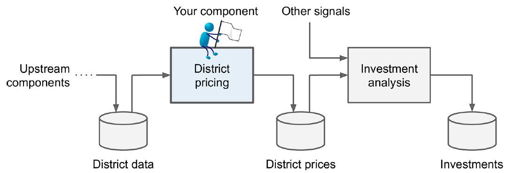

## Big data and cloud platforms (module 2)

#### California housing prices

---

## Integrated analytics lab

* Building data pipelines
  * Frame the problem and look at the big picture
  * Get the data
  * Explore the data to gain insights
  * Prepare the data
  * Explore different models and find the best ones
  * Fine\-tune your models
  * Present your solution
  * Launch\, monitor\, and maintain your system

---

* Building data pipelines

---

* Building data pipelines
  * Frame the problem and look at the big picture
    * Frame the problem  and look at the big picture
    * _"We’ll use the California Housing Prices\. Our task is to use California census data to forecast housing prices given the population\, median income\, and median housing price for each block group in California\. Block groups are the smallest geographical unit for which the US Census Bureau publishes sample data \(a block group typically has a population of 600 to 3\,000 people\)"_
    * Knowing the objective  is important because it will determine how you frame the problem\, which algorithms you will select\, which performance measure you will use to evaluate your model\, and how much effort you will spend tweaking it\.
    * _"Your boss answers that your model’s output \(a prediction of a district’s median housing price\) will be fed to another Machine Learning system\, along with many other signals\. This downstream system will determine whether it is worth investing in a given area or not\. Getting this right is critical\, as it directly affects revenue\."_

---

* Building data pipelines
  * Frame the problem and look at the big picture
    * ✔Define the objective in business terms
    * ✖How should performance be measured? \(postponed for later\)
  * Get the data
    * ✔ List the data you need and how much you need
      * Data could be available in a relational database and/or spread across multiple tables/documents/files
      * In this project\, however\, things are much simpler
  * Explore the data to gain insights
    * ✔ Create an environment to keep track of your data exploration
      * You have been provided with notebook environments
    * _✔ Study each attribute and its characteristics_
      * _Let's do this\!_

---

## In action