## BIG DATA AND CLOUD PLATFORMS

---

## Batch ingestion and processing

---

## Soil moisture monitoring as a case study

Optimizing soil moisture is crucial for watering and crop performance \[1\]
  * GOAL : build an expert system to save water while improving fruit quality (i.e., provide a recommendation of the optimal amount of water)
  * Soils  have different water retention
  * Watering systems  have different behaviors (e.g., drippers and sprinklers)
  * Plants  have different water demand (e.g., Kiwi \[2\] vs Grapes)
  * Sensors  produce different measurements with different precisions

\[1\] Turkeltaub et al., Real-time monitoring of nitrate transport in the deep vadose zone under a crop field–implications for groundwater protection, Hydrology and Earth System Sciences 20 (8) (2016) 3099–3108.\[2\] M. Judd, et al., Water use by sheltered kiwifruit under advective conditions, New Zealand journal of agricultural research 29 (1) (1986) 83–92.

We need to understand how the soil behaves
Simulate  \[1, 2\] the soil behavior according to physical models \[3\]
  * However, a  fine tuning  is required
  * We need to  know/parametrize everything
    * Soil (e.g., retention curve, hysteresis \[3\])
    * Plant (e.g., roots, LAI)
    * Weather conditions (temperature, humidity, wind, precipitations)
    * Watering system (e.g., capacity, distance between drippers)
Tuning can take months (of human interactions)\!
  * Need to collect samples from the field… if parameters are incorrect, trace back
  * Need to implement/code all these features into the simulator \[1, 2\]
  * Hyper-parameter tuning with machine learning can help, but it is not a silver bullet

\[1\] Šimunek, J., et al. "HYDRUS: Model use, calibration, and validation." Transactions of the ASABE 55.4 (2012): 1263-1274.\[2\] Bittelli, Marco, et al. Soil physics with Python: transport in the soil-plant-atmosphere system. OUP Oxford, 2015.\[3\] Van Genuchten, M. Th. "A closed‐form equation for predicting the hydraulic conductivity of unsaturated soils." Soil science society of America journal 44.5 (1980): 892-898.\[4\] Pham, Hung Q., Delwyn G. Fredlund, and S. Lee Barbour. "A study of hysteresis models for soil-water characteristic curves." Canadian Geotechnical Journal 42.6 (2005): 1548-1568.

But… we have sensors\!                  \[1\]                                      \[2\]                                          \[3\]

These settings are too coarse to monitor soil moisture with precision, and they require many sensors

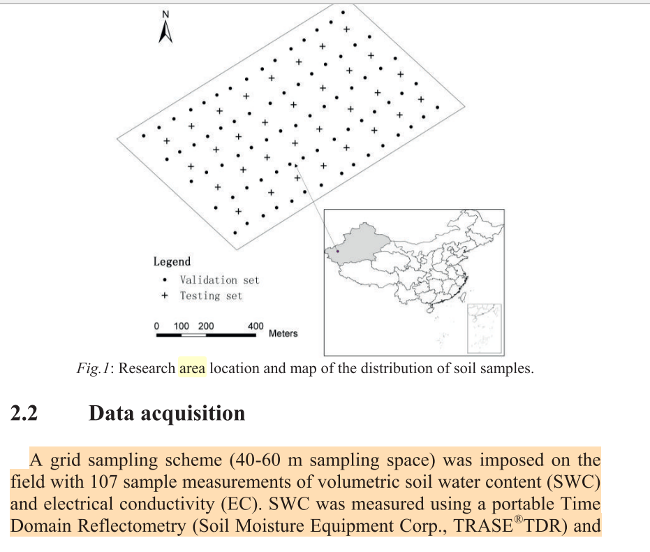

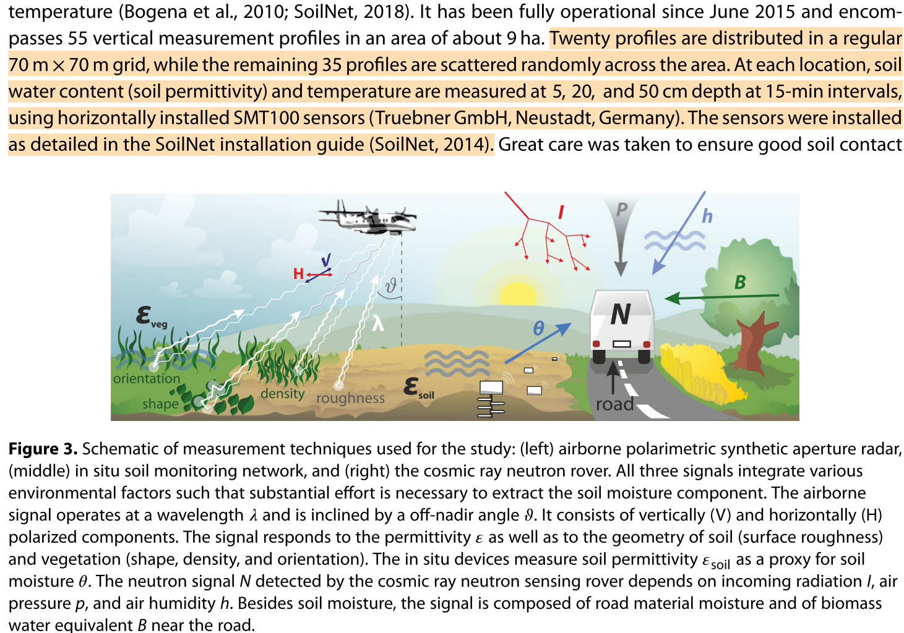

\[1\] Koyuncu, Hakan, et al. "Construction of 3D soil moisture maps in agricultural fields by using wireless sensor communication." Gazi University Journal of Science 34.1 (2021): 84-98.\[2\] Zheng, Zhong, et al. "Spatial estimation of soil moisture and salinity with neural kriging." International Conference on Computer and Computing Technologies in Agriculture. Springer, Boston, MA, 2008.\[3\] Fersch, Benjamin, et al. "Synergies for soil moisture retrieval across scales from airborne polarimetric SAR, cosmic ray neutron roving, and an in situ sensor network." Water Resources Research 54.11 (2018): 9364-9383.

---

## Reference scenario

We consider an orchard where
  * Kiwi plants  are aligned along  rows
  * Each row has many  drippers  (e.g., 1 every meter)
  * Drippers can water a  limited soil volume

Francia, Matteo, et al. "Multi-sensor profiling for precision soil-moisture monitoring." Computers and Electronics in Agriculture 197 (2022): 106924.

---

## Sensor layouts and symmetry assumptions

When the watered volume is symmetric along the row, a  2D grid of sensors  (left) is sufficient to represent the entire soil volume
When relevant moisture variations take place along the row too, a  3D grid of sensors  (right) is required
  * E.g., too sparse drippers
  * E.g., non-homogeneous suction of the roots

Francia, Matteo, et al. "Multi-sensor profiling for precision soil-moisture monitoring." Computers and Electronics in Agriculture 197 (2022): 106924.

---

## From sensors to soil profiles

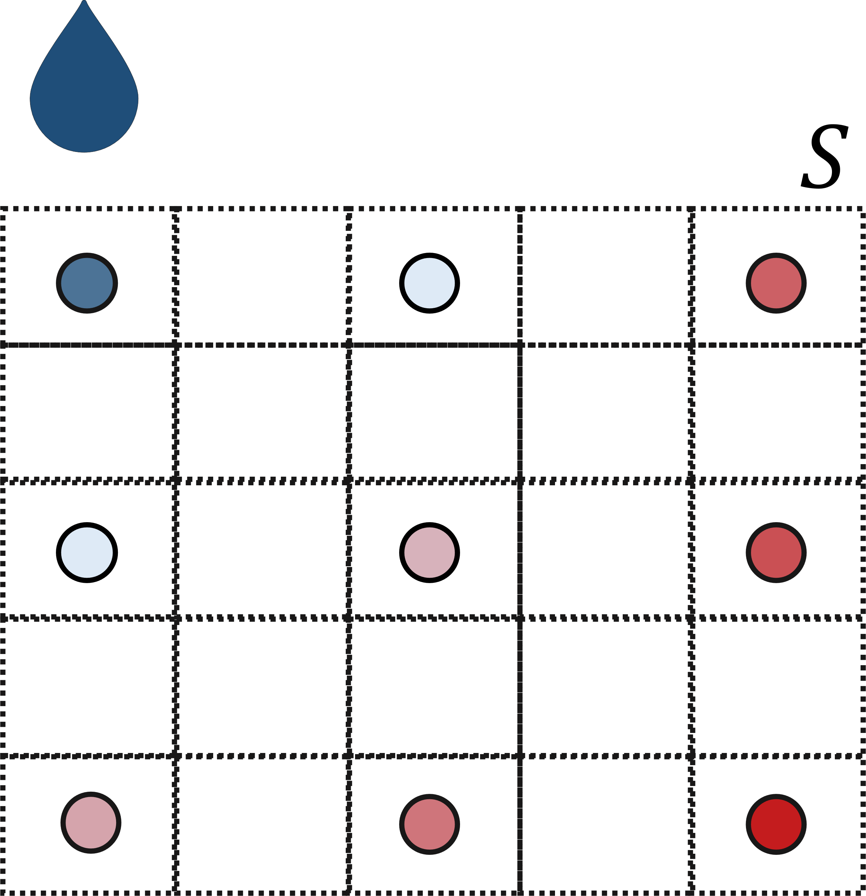

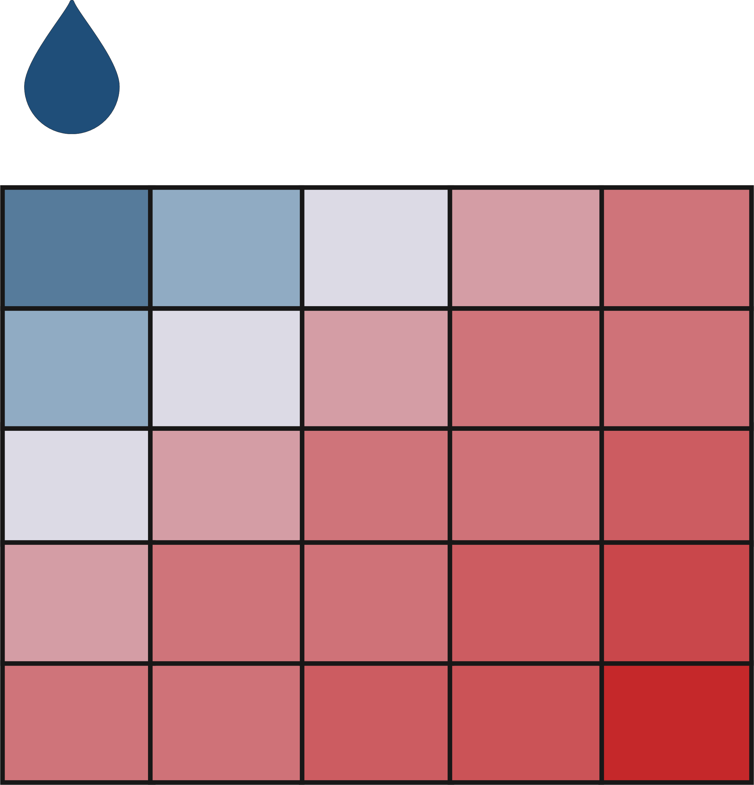

(a) Soil moisture is a continuum in the soil
(b) Sensors return a discretized representation of soil moisture
  * Depending on the number of sensors and on their layout the monitoring accuracy changes
(c) Goal**: produce fine-grained soil profiles out of coarse-grained layouts

Francia, Matteo, et al. "Multi-sensor profiling for precision soil-moisture monitoring." Computers and Electronics in Agriculture 197 (2022): 106924.

---

## To do

Create a data lake (AWS S3)

(Manually) Upload the sensor data

Do ETL (with AWS SageMaker and/or AWS Glue)

Create the relational data warehouse (AWS RDS)

Query the data warehouse (Tableau)

---

## Data lake: AWS S3

AWS Simple Storage Service (S3)
  * A serverless object storage service offering industry-leading scalability, data availability, security, and performance.
  * Customers of all sizes and industries can store and protect any amount of data for virtually any use case, such as data lakes

Last access 2022-08

---

## Data exploration: AWS SageMaker

Amazon SageMaker
  * Fully managed service that provides machine learning (ML) capabilities for data scientists and developers to prepare, build, train, and deploy high-quality ML models efficiently

Last access 2022-08

---

## ETL: AWS Glue

AWS Glue
  * A serverless data integration service to discover and prepare data for analytics
  * Provide capabilities for data integration so that you can start analyzing your data and putting it to use in minutes
  * Provide both visual and code-based interfaces to make data integration easier
  * Users can easily find and access data using the AWS Glue Data Catalog

Last access 2022-08

Last access 2022-08

Last access 2022-08

Last access 2022-08

Last access 2022-08

select  date\_format(timestamp, 'yyyy-MM-dd HH')  as  hour,        date\_format(timestamp, 'yyyy')  as  year,       date\_format(timestamp, 'yyyy-MM')  as  month,       date\_format(timestamp, 'yyyy-MM-dd')  as  date,       concat('(', xx, ', ', yy, ')')  as  sensor,       xx  as  dist, yy  as  depth, value, timestamp from  (      select  from\_unixtime( int (timestamp / 3600) \* 3600)  as  timestamp,            xx, yy,  avg (value)  as  value      from  myDataSource      group by  xx, yy,  int (timestamp / 3600) \* 3600)

Last access 2022-08

Last access 2022-08

---

## DWH: AWS RDS

Amazon Relational Database Service (Amazon RDS)
  * A collection of managed services that makes it simple to set up, operate, and scale relational databases in the cloud

Last access 2022-08

Last access 2022-08

Last access 2022-08

Last access 2022-08

---

## Projecting the DWH

---

## BIG DATA AND CLOUD PLATFORMS

---

## Building data pipelines

---

## Reference scenario

The big-data cube
  * Volume: small to big
  * Variety: structure to unstructured
  * Velocity: pull to push

Meijer, Erik. "Your mouse is a database." Communications of the ACM55.5 (2012): 66-73.

**Volume**
  * **Small**: small relational DBs
  * **High**: TBs o PBs of data

**Variety**
  * **Structured**
    * Relational tuples with FK/PK relationships
  * **Unstructured**
    * Key-value
    * Columnar
    * Document-based
    * Graph
    * ...

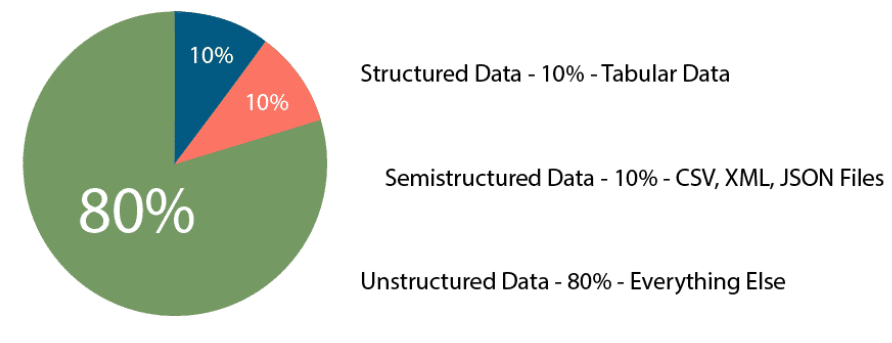

[https://www.datamation.com/big-data/structured-vs-unstructured-data/](https://www.datamation.com/big-data/structured-vs-unstructured-data/) (accessed 2022-08-01)

**Velocity_(latency)
  * **High**: clients synchronously pulling data from sources
  * **Low**: sources asynchronously pushing data to clients
**Velocity_(speed; dual to latency)
  * **High**: processing in real-time (milliseconds) or near-real time (minutes)
  * **Low**: processing can take hours

Collecting data

Processing data

  * _Scheduled Batch_
    * Large volume of data processed on a regular scheduled basis
    * Velocity is very predictable
  * _Periodic_ :
    * Data processed at irregular times (e.g., after collecting a certain ---large--- amount of data)
    * Velocity is less predictable
  * _Near real-time_
    * Streaming data processed in small individual batches collected and processed within minutes
    * Velocity is a huge concern
  * _Real-time_
    * Streaming data collected and processed in very small individual batches within milliseconds
    * Velocity is the paramount concern

  * _Batch and periodic_
    * Once data has been collected, processing can be done in a controlled environment
    * There is time to plan for the appropriate resources
  * _Near real-time and real-time_
    * Collection of the data leads to an immediate need for processing
    * Depending on the complexity of the processing (cleansing, scrubbing, curation), this can slow down the velocity of the solution significantly
    * Plan accordingly

Acceleration
  * The rate at which large collections of data can be ingested, processed, and analyzed
  * Acceleration is not constant, it comes in bursts
  * Take Twitter as an example
    * Hashtags can become hugely popular and appear hundreds of times in just seconds
    * … or slow down to one tag an hour
  * Your system must be able to efficiently handle the peak as well as the lows

Plus other Vs
  * **Veracity**:_data trustworthiness/quality
  * **Value**: ability to extract meaningful information
  * …
Our focus
  * (Un)Structured big-data batch
  * (Un)Structured big-data streams
**Goal**: keep in mind the cube to
categorize the services

---

## Reference scenario: batch vs stream

|  | Batch data processing | Stream data processing |
| :-: | :-: | :-: |
| Data scope | Queries or processing over all or most of the data in the dataset | Queries or processing over data within a rolling time window, or on just the most recent data record |
| Data size | Large batches of data | Individual records or micro batches consisting of a few records |
| Latency | Minutes to hours | Seconds or milliseconds |
| Analysis | Complex analytics | Simple response functions, aggregates, and rolling metrics |

---

## Reference scenario

Scenario 1
  * My business has a set of 15 JSON data files that are each about 2.5 GB in size.
  * They are placed on a file server once an hour, and they must be ingested as soon as they arrive in this location.
  * Data must be combined with all transactions from financial dashboard for this same period, then compared to the recommendations from marketing engine
  * All data is fully cleansed.
  * The results from this time period must be made available to decision makers by 10 minutes after the hour in the form of financial dashboards.

Which Vs are involved?

Scenario 1
  * My business has a set of 15 JSON data files that are each about 2.5 GB in size.
  * They are placed on a file server once an hour, and they must be ingested as soon as they arrive in this location.
  * Data must be combined with all transactions from financial dashboard for this same period, then compared to the recommendations from marketing engine
  * All data is fully cleansed.
  * The results from this time period must be made available to decision makers by 10 minutes after the hour in the form of financial dashboards.

Which Vs are involved?
  * Volume  This scenario describes huge JSON files to be combined with transactional data and marketing data.
  * Velocity  "Wait - now hurry up\!" Wait to collect data for a full hour and then produce meaningful results in 10 minutes  (is it batch or stream processing?)
  * Variety  three data source types: log files, transactional data, and recommendation information
  * Value  populate dashboards that are used by decision makers as soon as they are made available. The value is reached because it requires an understanding of what the organization is trying to accomplish

Scenario 2
  * My business compiles data generated by hundreds of corporations.
  * This data is delivered to us in very large files, transactional updates, and even data streams.
  * The data must be cleansed and prepared to ensure that rogue inputs do not skew the results.
  * Knowing the data source for each record is vital to the work we do.
  * A large portion of the data gathered is irrelevant to our analysis, so this data must be eliminated.
  * The final requirement is that all data must be combined and loaded into our data warehouse, where it will be analyzed.

Which Vs are involved?

Scenario 2
  * My business compiles data generated by hundreds of corporations.
  * This data is delivered to us in very large files, transactional updates, and even data streams.
  * The data must be cleansed and prepared to ensure that rogue inputs do not skew the results.
  * Knowing the data source for each record is vital to the work we do.
  * A large portion of the data gathered is irrelevant to our analysis, so this data must be eliminated.
  * The final requirement is that all data must be combined and loaded into our data warehouse, where it will be analyzed.

Which Vs are involved?
  * Volume  The data is delivered in very large files, transactional updates, and even in data streams
  * Variety  The business will need to combine the data from all three sources into a single data warehouse.
  * Veracity  The data is known to be suspect. The data must be cleansed and prepared to ensure that rogue inputs do not skew the results. Knowing the data source for each record is vital to the work we do.

---

## Data pipeline

Data pipeline
  *"A succession of operations to transform and consume raw data"_

[https://xkcd.com/2054/](https://xkcd.com/2054/)

Quemy, Alexandre. "Data Pipeline Selection and Optimization." DOLAP. 2019.

DIKW hierarchy
  * Layers representing structural relationships between data, information, knowledge, and wisdom

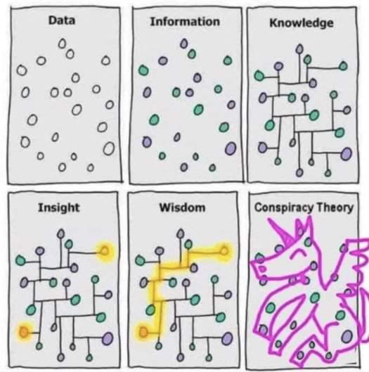

Ackoff, Russell L. "From data to wisdom." Journal of applied systems analysis 16.1 (1989): 3-9.

---

## Data pipelines on cloud

The pyramid abstracts tons of techniques, algorithms, etc.
To provide them as services, architecting data pipelines on cloud requires
  * Standardization (of common services)
  * Integration
  * Orchestration
  * Accessibility through simple APIs
Let us look to data pipelines on different cloud services providers

---

## Data pipeline - AWS

Three main categories
  * Ingest
    * Gateway, DataSync (batch)
    * Kinesis, SNS, SQS (stream)
  * Transform and store
    * S3 and Glacier (storage)
    * Glue (ETL)
  * Serve and consume
    * EMR (Hadoop-like cluster)
    * Athena (serverless query service to analyze data in Amazon S3)
    * (Many) Machine learning services

[https://console.aws.amazon.com/console](https://console.aws.amazon.com/console)

---

## Data pipeline - Google cloud

Three main categories
  * Ingest
    * Transfer service (batch)
    * Pub/Sub (stream)
  * Analyze
    * Dataproc (batch)
    * Dataflow (stream)
    * Cloud storage (storage)
    * Machine learning services
  * Serve
    * BigQuery (query service)

---

## A tentative organization

Two main ways to consume data:

Querying produces results that are great for quick analysis by data analysts.

BI tools produce visualizations that are grouped into reports and dashboards to help users explore data and determine the best actions to take

Common points
We have services
  * Which transforms data
    * Recall the DIKW pyramid
  * Which supports data transformation
Data pipelines are based on
  * Ingesting data
  * Analyzing data
  * Serving data

Transforming data to make it consumable this usually means sorting, aggregating, joining, and applying business logic to produce meaningful analytical data sets. The final step is to load this analytical data set into a new storage location, like a data lake, database, or data warehouse.

Supporting services

Serve (deciding/consume)

BI tools (e.g., Tableau)

Collecting raw data from

transactions

logs

IoT devices is a challenge.

A good data analysis solution allows developers to ingest a wide variety  of data at any speed, from batch to streaming

Analytics (analyzing/process)

Networking, etc.

Machine learning

Ingestion (acquiring/collect)

Real-time processing and analytics

Operational metadata

Batch processing and analytics

Slow storage (data lake)

ETL tools overlay

This is not a sharp taxonomy
Ingestion vs Analytics
  * Data streams are used for ingestion
  * ... and (event) processing

Supporting services

Serve (deciding)

BI tools (e.g., Tableau)

Analytics (analyzing)

Networking, etc.

Machine learning

Ingestion (acquiring)

This is not a sharp taxonomy
Storage vs Serving
  * Databases are storage
  * ... with processing capability
  * ... and with serving capability

Supporting services

Serve (deciding)

BI tools (e.g., Tableau)

Analytics (analyzing)

Networking, etc.

Machine learning

Ingestion (acquiring)

Supporting services

Serve (deciding)

BI tools (e.g., Tableau)

Analytics (analyzing)

Networking, etc.

Machine learning

Ingestion (acquiring)

---

## Storage

**Goal**: persisting data
Which storage do we choose?
  * **Storage model(or data model) ~= variety
    * How data are organized/accessed in a storage system
      * Structured vs unstructured
      * Data access model (key-value, column, etc.)
  * Access frequency**
  * **Analysesto be performed

---

## Storage models

Mansouri, Yaser, Adel Nadjaran Toosi, and Rajkumar Buyya. "Data storage management in cloud environments: Taxonomy, survey, and future directions." ACM Computing Surveys (CSUR) 50.6 (2017): 1-51.

---

## Storage models (AWS)

Data structure: structured
Data abstraction: database
Data access model: relational
**Relational**
  * Store data with predefined schemas and relationships between them
  * Support ACID transactions
  * Maintain referential integrity

[https://aws.amazon.com/products/databases/](https://aws.amazon.com/products/databases/)

Data structure: semi/unstructured
Data abstraction: database
Data access model: \*
  * **Key/value:store and retrieve large volumes of data
  * **Document :store semi-structured data as JSON-like documents
  * **Columnar:_use tables but unlike a relational database, columns can vary from row to row in the same table
  * **Graph:navigate and query relationships between highly connected datasets
  * **... and more**

[https://aws.amazon.com/products/databases/](https://aws.amazon.com/products/databases/)

---

## Storage models (Google Cloud)

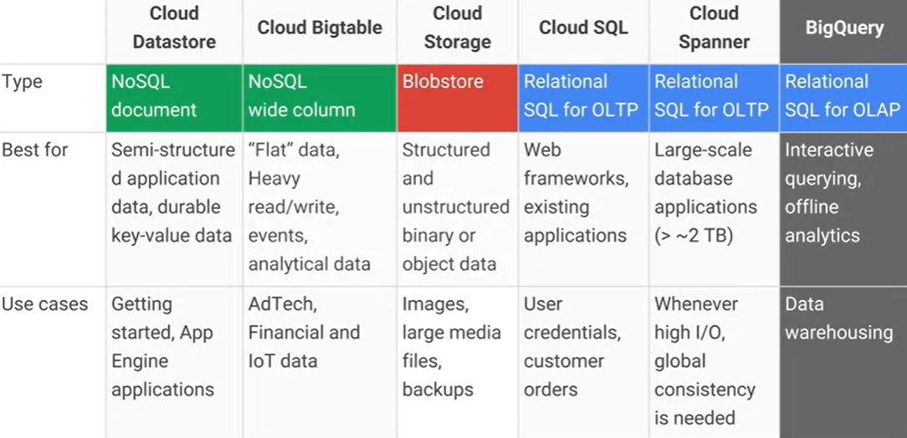

[https://cloud.google.com/products/databases](https://cloud.google.com/products/databases)

---

## Storage models (AWS)

Data structure: unstructured
Data abstraction: file (or database)
Data access model: key-value
**File system(EFS), object storage(S3) (or DB K-V_;_e.g., DynamoDB)
  * Handle unstructured data
  * ... organized as files (or blob)
  * ... accessed using a key-value
Differ in the supported features
  * E.g., maximum item size (DynamoDB: 400KB, S3: 5TB)
  * E.g., indexes, querying mechanisms, latency, etc.

---

## AWS S3

Simple Storage Service (S3)
  * Amazon S3 stores data as  _objects_    within  _buckets_ .
  * An  _object_    is composed of a file and any metadata that describes that file
    * Once objects have been stored in an Amazon S3 bucket, they are given an  _object key_ . Use this, along with the bucket name, to access the object.
  * _Buckets_  are logical containers for objects
    * You can have one or more buckets in your account
    * Control access for each bucket individually
    * Choose the geographical region where Amazon S3 will store the bucket and its contents
Benefits
  * Centralized data architecture (create a single—trustworthy—dataset)
    * Build a multi-tenant environment, where many users can bring their own data
    * Improve both cost and data governance over traditional solutions
    * Although this may require an additional step to load your data into S3
  * Decoupling of storage from compute and data processing.
    * You can cost-effectively store all data types in their native formats
    * Then, launch as many virtual servers needed or analytics tools needed to process your data

---

## AWS Redshift

Datawarehouse on AWS…

But what if we want to query data from the data lake as well? AWS Redshift Spectrum

HADOOP is a framework to both store and process data

EMR uses its own filesystem, we can use S3

---

## Storage: access frequency (AWS)

Object storage (AWS S3) classes**
  * **Standard**: general purpose
  * **Infrequent_(rapid) access**
  * **One Zone-IA**: lower-cost option for infrequently accessed data that do not require high availability and resilience
  * **Glacier**: low-cost storage class for data archiving, three retrieval options that range from a few minutes to hours
  * **Deep Glacier**: long-term retention for data accessed once or twice in a year. E.g., retain data sets for 10 years or longer
  * **Intelligent-Tiering**: move objects between access tiers when access patterns change

[https://aws.amazon.com/s3/storage-classes/](https://aws.amazon.com/s3/storage-classes/)

**Lifecycle_configuration
  * A set of rules that define actions that Amazon S3 applies to a group of objects
Two types of actions:
  * **Transition:when objects transition to another storage class. E.g., archive objects to the S3 Glacier storage class one year after creating them
  * **Expiration**: when objects expire. Amazon S3 deletes expired objects on your behalf

[https://docs.aws.amazon.com/AmazonS3/latest/userguide/object-lifecycle-mgmt.html](https://docs.aws.amazon.com/AmazonS3/latest/userguide/object-lifecycle-mgmt.html)

---

## Storage: access frequency (Google Cloud)

[https://cloud.google.com/blog/products/storage-data-transfer/archive-storage-class-for-coldest-data-now-available](https://cloud.google.com/blog/products/storage-data-transfer/archive-storage-class-for-coldest-data-now-available)

---

## Organizing the data lake

Having a consistent principles on how to organize your data is important
  * To build standardized pipelines with the same design with regard to where read/write data
  * Standardization makes it easier to manage your pipelines at scale
  * Helps data users search for data in the storage and understand exactly to find what they need
  * Decoupling storage from processing

Landing area (LA)
  * Save  raw data  from ingestion
  * Transient, data is not stored for long term
Staging area (SA)
  * Raw data goes through a set of common transformations: ensuring  basic quality  and making sure it  conforms to existing schemas  for this data source and then data is saved into SA
Archive area (A)
  * After saving into SA, raw data from LA should be  copied into the archive  to reprocess any given batch of data by simply copying it from AA into LA
  * Useful for debugging and testing

Production area (PA)
  * Apply the business logic to data from SA
Pass-through job
  * Copy data from SA to PA and then into DWH without applying any business logic
  * Optional, but having a data set in the data warehouse and PA that is an exact replica can be helpful when debugging any issues with the business logic
Cloud data warehouse (DWH)
Failed area (FA)
  * You need to be able to deal with all kinds of errors and failures
  * There might be bugs in the pipeline code, cloud resources may fail

---

## 

---

## Organizing the data lake

| Area | Permissions | Tier |
| :-: | :-: | :-: |
| Landing | Ingestion applications can write Scheduled pipelines can readData consumers can't access | Hot |
| Staging | Scheduled pipelines can read/write Selected data consumers can read | Hot |
| Production | Scheduled pipelines can read/writeSelected data consumers can read | Hot |
| Archive | Scheduled pipelines can writeDedicated data reprocessing pipelines can read  | Cold or archive |
| Failed | Scheduled pipelines can writeDedicated data reprocessing pipelines can readData consumers don't have access | Hot |

Use folders to organize data inside areas into a logical structure
  * Namespace
    * Logically group multiple pipelines together.
  * Pipeline name
    * Each data pipeline should have a name that reflects its purpose. For example
      * A pipeline that takes data from the LA, applies common processing steps, and saves data into SA
      * You will also have one for archiving data into AA
  * Data source name
    * Ingestion layer will assign a name to each data source you bring into the platform
  * BatchId
    * Unique identifier for any batch of data that is saved into LA
    * E.g., Since only ingestion can write to LA, it is its responsibility to generate this identifier
    * A common choice for this type of an identifier is a Universally Unique Identifier (UUID)
Different areas will have slightly different folder structures
  * /landing/ ETL / sales\_oracle\_ingest / customers / 01DFTFX89YDFAXREPJTR94

---

## A tentative organization

Supporting services

Serve (deciding)

BI tools (e.g., Tableau)

Analytics (analyzing)

Networking, etc.

Machine learning

Ingestion (acquiring)

---

## Bulk vs. Streaming systems

What is a bulk processing system?
  * High latency
  * Exact results
  * Process massive data at once
    * ... is this true?

What is a streaming system?
  * Low latency
  * Approximate result
    * ... is this true?
  * Process data item by data item
    * ... is this true?

What is a bulk processing system?
  * An engine capable to handle processing on bounded_datasets

What is a streaming system?
  * An engine capable to handle processing on unbounded_datasets
  * Streaming is a superset of batch processing

Akidau, Tyler, Slava Chernyak, and Reuven Lax. Streaming systems: the what, where, when, and how of large-scale data processing. " O'Reilly Media, Inc.", 2018.

---

## Ingestion: bulk

**Goal**: moving data to the cloud
Moving data to the cloud
  * 80TB  of data to move,
  * 1Gbps  connection to the internet
How many days?
  * 80000GB  / ( 1Gbps / 8 ) / 60 / 60 / 24 ~= a week without internet

Batch/Bulk: move data from on-premises storage
Workflow
  * Receive shipment
  * Set up
  * Transfer data
  * Ship back (shipping carrier)

---

## Ingestion: bulk (AWS)

AWS Snowball
  * 50TB (North America only) and 80TB versions
  * Not rack-mountable
Throughput
  * 1 Gbps or 10 Gbps using an RJ-45 connection
  * 10 Gbps using a fiber optic connection

[https://aws.amazon.com/snowball/](https://aws.amazon.com/snowball/)

---

## AWS Snowmobile

[https://youtu.be/8vQmTZTq7nw](https://youtu.be/8vQmTZTq7nw)

---

## Ingestion: stream

**Stream**: real-time streaming data
**Event**: anything that we can observe occurring at a particular point in time
**Continuous streaming**
  * Illimited succession of individual events
  * Ordered by the point in time at which each event occurred
**Publish/subscribe (pub/sub)**: a way of communicating messages
  *Senderspublish messages associated with one or more topics**
  *Receiverssubscribe to specific topics, receive all messages with that topic
  *Messagesare events

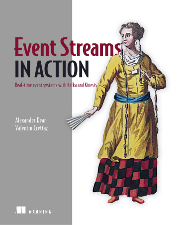

[https://www.manning.com/books/event-streams-in-action](https://www.manning.com/books/event-streams-in-action)

General idea:
  * Collect events from many source systems
  * Store them in a unified log
  * Enable applications to operate on these event streams
**Unified log**
  * Unified,  append-only,  ordered,  distributed  log that allows the centralization of event streams

What would happen without the log?
  * Note that data often flows in both directions, as many systems (databases and Hadoop) are both sources and destinations for data transfer.
  * This meant that we would end up building two pipelines per system: one to get data in and one to get data out.
  * As we approached full connectivity, we would end up with something like O(N2) pipelines

Kreps, Jay. I heart logs: Event data, stream processing, and data integration. " O'Reilly Media, Inc.", 2014.

Log
  * Append-only data structure
  * the destination system only knows about the log and does not know any details of the system of origin
  * The consumer system need not concern itself with whether the data came from a relational database, a new-fangled key-value store, or was generated directly by some application
Think of the log as acting as a kind of messaging system with durability guarantees and strong ordering semantics

Kreps, Jay. I heart logs: Event data, stream processing, and data integration. " O'Reilly Media, Inc.", 2014.

Why do you need a log at all in stream processing?
Why not communicating directly using messaging protocols?
A log enables
  * Multi-subscriber: each data item is available to any processor that wants it
  * Order: maintained in the processing done by each consumer of data
  * Buffering and isolation to the individual processes
    * E.g., a that processor produces faster than its downstream consumer can keep up
  * Reprocessing, maintaining state, etc.
Indeed, logs are common:
  * MapReduce workflows use files to checkpoint and share their intermediate results
  * SQL processing pipelines create intermediate or temporary tables

**Unified**: a single log in a company with applications sending/reading events
  * Log serves as central data backbone
    * It can contain many distinct continuous streams of events
    * Not all events are sent to the same event stream
**Append-only**: new events are appended to the unified log
  * Existing events are never updated in place
    * If read the event ---

##10, never look at events 1 through 10 again
  * Events are automatically deleted from the unified log when they age
    * E.g., automatically remove events after 7 days

**Distributed**: the unified log lives across a cluster of machines
  * Optionally divide events into shards (i.e., partitions)Still, the log is unified since we have a single (conceptual) log
Distribution ensures
  * Scalability: work with streams larger than the capacity of single machines
  * Durability: replicate all events within the cluster to overcome data loss
  * Using a log as a universal integration mechanism is never going to be more than an elegant fantasy if we can't build a log that is fast, cheap, and scalable

**Ordered**: events in a shard have a sequential IDs (unique in a shard)
  * Local ordering keeps things much simpler than global ordering
  * Applications maintain their own cursor for each shard

Lamport, Leslie. "Time, clocks, and the ordering of events in a distributed system." Concurrency: the Works of Leslie Lamport. 2019. 179-196.

Two types of processing
  * **Single-event:_a single event produces zero or more events
    * Validating "Does this event contain all the required fields?"
    * Enriching "Where is this IP address located?"
    * Filtering "Is this error critical?"
  * **Multiple-event:_multiple events collectively produce zero or more events
    * Aggregating, functions such as minimum, maximum, sum
    * Pattern matching, looking for patterns or co-occurrence
    * Reordering events based on a sort key

---

## Ingestion: stream (AWS)

Amazon Kinesis Data Streams
  * Created and provisioned by shard
    * Each shard provides 1 MBps and 1000 data puts per second
  * A data record consists of
    * User-supplied partition key to balance records across shards
    * Incremental sequence number added by the shard
    * A data blob
  * Consumers get records by shard
    * Records are sorted by partition key and sequence number
    * Ordering is not guaranteed across shards
  * Records are retained for 7 days at maximum

[https://docs.aws.amazon.com/streams/latest/dev/key-concepts.html](https://docs.aws.amazon.com/streams/latest/dev/key-concepts.html)

Re-sharding (i.e., scaling)
  * Split a shard into two, or merge two shards
  * Users must scale shards up and down manually
    * Monitor usage with Amazon CloudWatch and modify scale as needed
  * Avoid shard management by using Kinesis Data Firehose
Kinesis is a regional service, with streams scoped to specific regions
  * All ingested data must travel to the region in which the stream is defined
Costs
  * Priced by shard hour, data volume, and data retention period
  * Pay for resources you provision (even if not used)

[https://aws.amazon.com/cloudwatch/](https://aws.amazon.com/cloudwatch/)[https://aws.amazon.com/kinesis/data-firehose](https://aws.amazon.com/kinesis/data-firehose)

---

## Ingestion: stream

| Feature | AWS Kinesis | Google Pub/Sub |
| :-: | :-: | :-: |
| Unit of deployment | Stream | Topic |
| Unit of provisioning | Shard | N/A (fully managed) |
| Data unit | Record | Message |
| Data producer/destination | Producer/Consumer | Publisher/Subscriber |
| Data partitioning | User-supplied partition key | N/A (fully managed) |
| Retention period | Up to 7 days | Up to 7 days |
| Pricing | Per shard-hour, PUT payload units, and optional data retention | Message ingestion and delivery, and optional message retention |

---

## A tentative organization

Supporting services

Serve (deciding)

BI tools (e.g., Tableau)

Analytics (analyzing)

Networking, etc.

Machine learning

Ingestion (acquiring)

---

## Serverless computing/processing

AWS Lambda: compose code functions in a loose orchestration
  * Build modular back-end systems
  * Event-driven and push-based pipelines
With Lambda, you are responsible only for your code (Lambda function)
  * Lambda manages the compute fleet that offers a balance of memory and CPU
  * Lambda performs operational and administrative activities on your behalf
    * Provisioning capacity, monitoring fleet health, applying security patches, etc.

---

## Serverless computing (AWS Lambda)

AWS Lambda
  * A Lambda function is a granular service
  * The Lambda runtime invokes a lambda function multiple times in parallel
  * Compute service that executes code written in JavaScript/Python/C---

##/Java
    * Elastic Compute Cloud (EC2) servers run the code (e.g., a Linux server)
  * A function is \`code \+ configuration \+ dependencies\`
    * Source code (JARs or DLLs) is zipped up and deployed to a container
  * Invocation supports push/pull events

---

## Serverless computing (FaaS)

FaaS: write single-purpose stateless functions
  * Keep the single responsibility principle in mind
  * A function that does just one thing is more testable and robust
  * A function with a well-defined interface is also more likely to be reused
  * Code should be created in a stateless style
    * Statelessness allows scalability
    * Local resources or processes will not survive along sessions
  * Functions that terminate sooner are cheaper
    * E.g., pricing is based on ---

##requests, execution time, and allocated memory

---

## Patterns for data pipelines

Patterns are architectural solutions to problems in software design
  * A (design) pattern is a general, best-practice reusable solution to a commonly occurring problem within a given context in software design
  * It is a template for how to solve a problem in many different situations
Patterns for serverless data pipelines
    * Command pattern
    * Messaging pattern
    * Priority queue pattern
    * Pipes and filters pattern

[https://www.manning.com/books/aws-lambda-in-action](https://www.manning.com/books/aws-lambda-in-action)

---

## Command pattern

Command pattern
  * A behavioral design pattern in which an object is used to encapsulate the information needed to perform an action or trigger an event
Encapsulate a request as an object
  * Issue requests to objects without knowing anything about the operation being requested or the receiver

[https://aws.amazon.com/api-gateway](https://aws.amazon.com/api-gateway)

---

## Pipes and filters pattern

Decompose a complex processing task into a sequence of manageable services
  * Components designed to transform data are referred to as filters
  * Connectors that pass data between components are referred to as pipes

---

## Messaging pattern

Messaging pattern
  * Describes how two different parts of a message passing system connect and communicate with each other
Decouple services from direct dependence and allow storage of events in a queue
  * Reliability: if the consuming service goes offline, messages are retained in the queue and can still be processed
  * A message queue can have a single sender/receiver or multiple senders/receivers

---

## Priority queue pattern

Decouple and prioritize requests sent to services
  * Requests with a higher priority are received and processed more quickly than those with a lower priority
  * Useful in applications that offer different service level guarantees
Control how and when messages are dealt with
  * Different queues, topics, or streams to feed messages to your functions
  * High-priority messages go through expensive services with more capacity

---

## A tentative organization

Supporting services

Serve (deciding)

BI tools (e.g., Tableau)

Analytics (analyzing)

Networking, etc.

Machine learning

Ingestion (acquiring)

---

## Identity and Access Management

Identity and Access Management (IAM)
  * Web service that controls fine-grained access to AWS resources
  * IAM controls who is authenticated and authorized to use resources
IAM user
  * Unique identity recognized by AWS services and applications
  * Similar to user in an operating system like Windows or UNIX

IAM role
  * Set of policies for making AWS service requests
  * Trusted entities (e.g., such as IAM users) assume roles
    * Delegate access with defined permissions to trusted entities
    * There is no limit to the number of IAM roles a user can assume
User vs role
  * User has permanent long-term credentials and is used to directly interact with AWS services
  * Role does not have credentials and cannot make direct requests to AWS services
  * Roles are assumed by authorized entities, such as IAM users

Alice (i.e., an IAM user) is a firewoman
  * She is the same person with or without her turnout gear
  * As a firewoman (i.e., a role)
    * If she speeds to a house fire and passes a police officer, he isn't going to give her a ticket
    * In her role as a firewoman, she is allowed to speed to the house fire
  * As a private citizen (i.e., another role)
    * When she is off duty, if she speeds past that same police officer, he's going to give her a ticket
    * In her role as a private citizen, she is not allowed to speed

---

## A tentative organization

Supporting services

Serve (deciding)

BI tools (e.g., Tableau)

Analytics (analyzing)

Networking, etc.

Machine learning

Ingestion (acquiring)

---

## Single instance: AWS EC2

Amazon Elastic Compute Cloud
  * A web service that provides resizable compute capacity
  * Complete control of computing resources
    * Processor, storage, networking, operating system, and purchase model
Amazon Machine Image is a template of a software configuration
  * E.g., an operating system, an application server, and applications
  * From an AMI, you launch (multiple) instances running as a virtual servers

[https://aws.amazon.com/ec2/](https://aws.amazon.com/ec2/)[https://docs.aws.amazon.com/AWSEC2/latest/UserGuide/compute-optimized-instances.html](https://docs.aws.amazon.com/AWSEC2/latest/UserGuide/compute-optimized-instances.html) (example of AMI)

An instance type determines the hardware of the host computer
  * Each instance type offers different compute and memory capabilities
  * After launch, you can interact with it as you would with any computer
  * You have complete control of your instances
    * E.g., \`sudo\` to run commands

[https://aws.amazon.com/ec2/instance-types/](https://aws.amazon.com/ec2/instance-types/)

[https://aws.amazon.com/ec2/instance-types/](https://aws.amazon.com/ec2/instance-types/)

---

## Cluster: AWS EMR

Amazon EMR is a data platform based on the Hadoop stack
  * Apache Spark, Apache Hive, Apache HBase, etc.
  * You can run workloads on
    * Amazon EC2 instances
    * Amazon Elastic Kubernetes Service (EKS) clusters
    * On-premises using EMR on AWS Outposts
Example of workload
  * Upload input data into Amazon S3
  * EMR launches EC2 instances that you specified
  * EMR begins the execution while pulling the input data from S3 into the launched instances
  * Once the cluster is finished, EMR transfers output data to Amazon S3

---

## BIG DATA AND CLOUD PLATFORMS

---

## Cluster migration - Based on a true story​

---

## Migration

Goals
  * Evaluating the costs for a cloud/on-premises data platform
  * Real-world case study
  * Fill in this table

| Cost | On-premises | On cloud |
| :-: | :-: | :-: |
| Hardware | ? | ? |
| Software | ? | ? |

---

## Case study

Business intelligence group

---

## Migration

Spatial Cube (PostGIS)

Reference architecture

Mobile Interface

ODS (Hbase \+ PostGIS)

Integration processes

Loading processes

Notebook Interface

Data Lake (Hadoop)

Enrichment processes

Acquisition processes

_External sources_

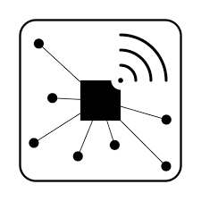

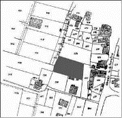

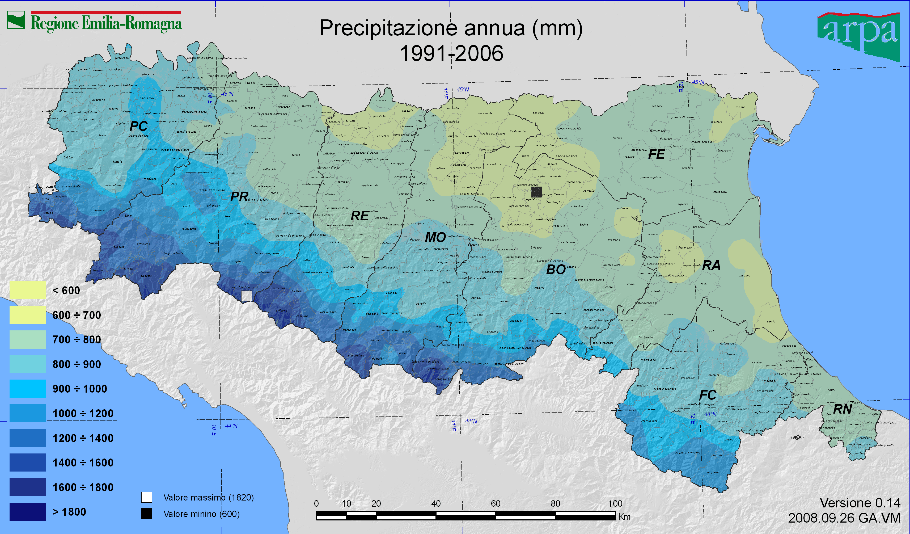

Administrative

borders

Rural Land

register

Satelliteimages

On-the-field sensors

Reference architecture

Hardware
Software
  * "Classic" Hadoop stack

8 CPUs (144 total)
  * - Intel(R) Core(TM) i7-8700 CPU @ 3.20GHz
32GB RAM (576GB total)
  * - 2 x 16GB DIMM DDR4 2666 MHz
12TB HDD Disk (216TB total)
  * - 3 x 4TB ST4000DM004-2CV1

lshw -short -C cpu

lshw -short -C memory

lshw -short -C disk

| SOLonprem | On-premises | On cloud |
| :-: | :-: | :-: |
| Hardware | ? | ? |
| Software | ? | ? |

**Hardware cost**: ?
  * Refer to [https://www.rect.coreto-europe.com/en/search.html?clearsearch=1](https://www.rect.coreto-europe.com/en/search.html?clearsearch=1)

---

## On-premises

| SOLonprem | On-premises | On cloud |
| :-: | :-: | :-: |
| Hardware | 10602€/year | ? |
| Software | ? | ? |

**Hardware cost(up to Mar 05, 2021):  1767€ x 18 = 31806€
  * Amortization over 3 years (i.e.,  10602€/year )

[https://www.rect.coreto-europe.com/en](https://www.rect.coreto-europe.com/en) (Accessed 2021-08-01)

| SOLonprem | On-premises | On cloud |
| :-: | :-: | :-: |
| Hardware | 10602€/year | ? |
| Software | ? | ? |

**Software cost**: ?

| SOLonprem | On-premises | On cloud |
| :-: | :-: | :-: |
| Hardware | 10602€/year | ? |
| Software | 0€ | ? |

**Software cost(up to 2020): 0€
  * Free Cloudera Management System
  * No software licensing (for research purpose)

| SOLonprem | On-premises | On cloud |
| :-: | :-: | :-: |
| Hardware | 10602€/year | ? |
| Software | 180000€/year | ? |

**Software cost(up to Mar 05, 2021): 10000€/year x 18 = 180000€/year
  * Cloudera is no more free, 10K€ per node
  * [https://www.cloudera.com/products/pricing.html---

##private-cloud-services](https://www.cloudera.com/products/pricing.html---

##private-cloud-services)
  * [https://www.cloudera.com/products/pricing/product-features.html](https://www.cloudera.com/products/pricing/product-features.html)
  * No license for research purpose
*"Houston we've had a problem\!"_
  * We cannot update/extend the cluster anymore
  * What about migrating to the cloud? (we only consider AWS)

---

## Migration

Moving a Hadoop cluster to the cloud (we only consider AWS)
  * AWS price calculator [https://calculator.aws/---

##/estimate](https://calculator.aws/---

##/estimate)
How do we start?
  * We have already defined the hardware and the software stack
  * Start with coarse tuning, identify the dominating costs first
    * Is it computing, storage, or processing?
  * Identify a suitable budget, implement, refine later
    * Wrong refinements can do a lot of damage

---

## On cloud v1

| SOLcloud1 | On-premises | On cloud |
| :-: | :-: | :-: |
| Hardware | 10602€/year | ? |
| Software | 180000€/year | ? |

Migrating the cluster as-is: ?
  * Hint: add 18 EC2 instances satisfying the hardware requirements

| SOLcloud1 | On-premises | On cloud |
| :-: | :-: | :-: |
| Hardware | 10602€/year | 162000$/year |
| Software | 180000€/year | ? |

SOLcloud1 migrating the cluster as-is:  13500$/month = 162000$/year
  * 18 EC2 instances (t4g.2xlarge) with 12TB EBS storage each machine
  * Still, we have no software configuration

[https://calculator.aws/---

##/estimate?id=7757afffccc3cafdcfdeb212b74623ef02ed5a36](https://calculator.aws/---

##/estimate?id=7757afffccc3cafdcfdeb212b74623ef02ed5a36)

---

## Migration

Pay attention to the region
  * Different regions, different prices
  * Different regions, different services
  * Remember the GDPR and data locality

It makes no sense to move the cluster as-is
  * More machines ensure better (on-prem) scalability but higher costs
How do we proceed with the migration?
  * We need minimum software requirements
  * Try to achieve the smallest migration impact
    * Find the most similar cloud-based solution to a Hadoop cluster
    * Rethink applications (later) when you got the know-how
  * Identify a suitable budget, implement, refine later
    * Wrong refinements can do a lot of damage

**HDFS**
  * How much durability do we need?
    * HP0: three replicas (we stick to this)
    * HP1: decrease replicas for cold data
    * HP2: move cold data to glacier or delete id
    * ...
**HBase_has marginal effects on the pricing (100GB << 50TB)
  * For simplicity, we can omit it
**Overall**: 50TB storage/year

Processing takes place each time that ESA provides a satellite image
  * Some days no images are available
  * Some days up to 10 images are available
  * Spark jobs are always executed with the same parameters
**Image processing**
  * 4 machines, 2 cores, 10GB RAM at least
**Weather processing_is negligible

Image processing

4 Executors (2 cores and 10GB RAM each)

Driver (2 cores and 20GB RAM)

: 15m/core (2h total)

Weather processing

2 Executors (1 core and 500MB RAM each)

Driver (1 core and 1GB RAM)

: 0.5 m/core (1m total)

---

## On cloud v2

|  | On-premises | On cloud |
| :-: | :-: | :-: |
| Hardware | 2356€/year | 38000$/year |
| Software | 100000€/year | ? |

Assuming 1 Executor = 1 Machine
  * Compare 4 machines on-premises vs on cloud
On-premises
  * 4 machines: 10602€/year / 18 machines x 4 machines =  2356€/year
  * Cloudera requires at least 10 nodes:  100000€/year
AWS
  * 4 EC2 instances: 162000$/year / 18 machines x 4 machines =  36000$/year
    * Plus the resources for master services =  2000$/year
  * Problems
    * Still no software stack
    * A lot of storage cost
    * Machines are up-and-running even when no computation is necessary (just to persist data)

|  | On-premises | On cloud |
| :-: | :-: | :-: |
| Hardware | 2356€/year | 36000$/year |
| Software | 100000€/year | ? |

Assuming 1 Executor = 1 Machine
  * Compare 4 machines on-premises vs on cloud
On-premises
  * 4 machines: 10602€/year / 18 machines x 4 machines =  2356€/year
  * Cloudera requires at least 10 nodes:  100000€/year
AWS
  * 4 EC2 instances: 162000$/year / 18 machines x 4 machines =  36000$/year

AWS
  * Still, we have no software stack configuration
  * Which is the major cost?

AWS
  * Still, we have no software stack configuration
  * Which is the major cost?

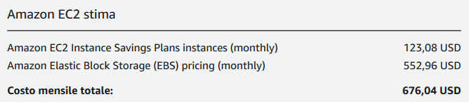

---

## Migration

S3 standard

S3 Infrequent Access

AWS Software stack
Manual
  * Use EC2 instances in IaaS
  * Technological and business challenges of manual installation and maintenance remain
EMR (Elastic Map Reduce)
  * Provides a managed Hadoop framework
  * Provides service integration
    * Automatically control EC2 instances
    * Transparently use S3 storage
  * Is a service to be paid on-top of the price for EC2 instance

[https://aws.amazon.com/emr](https://aws.amazon.com/emr)

---

## Motivation

Amazon EMR (Elastic Map Reduce)
  * Provides a managed Hadoop framework
Some features
  * Service integration
    * Automatically control EC2 instances
    * Transparently use S3 storage
  * Pricing:
    * Low Hourly Pricing
    * Amazon EC2 Spot Integration

[https://aws.amazon.com/emr](https://aws.amazon.com/emr)

---

## EMR Cluster

Deploy Multiple Clusters

Provision as much capacity as you need

Add or remove capacity at any time

Resize a Running Cluster

EMR cluster
Master group controls the cluster
  * Coordinate the work distribution
  * Manage the cluster state
Core groups
  * Core instances run Data Node daemons
(Optional) Task instances

Amazon EMR Cluster

Master Instance Group

Task Instance Group

Core Instance Group

The central component of Amazon EMR is the cluster**
  * A collection of Amazon Elastic Compute Cloud (Amazon EC2)_instances
  * Each instance is called a node**
The node typeidentifies the role within the cluster
  * **Master_node coordinates the distribution of data and tasks among other nodes
    * Every cluster has (at least) a master node
    * Always active
  * **Core_node runs tasks and store data in the Hadoop Distributed File System (HDFS)
    * Multi-node clusters have at least one core node
    * Always active, contains the data node daemon
  * **Task_node only runs tasks
    * Task nodes are optional
    * Decoupling processing and storage, we lose data locality

---

## Migration

On-Demand Instance
  * Pay for compute capacity by the hour (minimum of 60 seconds)
  * No long-term commitments
Spot Instance
  * Unused EC2 instance that is available for less than the on-demand price
  * Hourly price is called spot price_
    * Adjusted based on long-term supply and demand for spot instances
  * Run the instance when capacity is available and price is below threshold
    * When data-center resources are low, spot instances are dropped
    * Mainly suitable for batch workloads

[https://aws.amazon.com/ec2/pricing/](https://aws.amazon.com/ec2/pricing/)

Spot Instance cost strategies
Capacity-optimized strategy
  * Allocated instances into the most available pools
  * Look at real-time capacity data, predict which are the most available
  * Works well for workloads such as big data and analytics
  * Works well when we have high cost of interruption
Lowest-price strategy
  * Allocates instances in pools with lowest price at time of fulfillment

---

## Creating the cluster

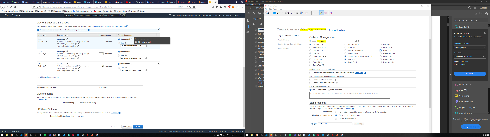

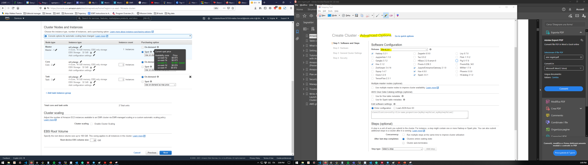

---

## EMR

Choose to launch master_, core_, or task_on Spot Instances
  * The master_node controls the cluster
    * When terminated, the cluster ends
    * Use spot instancesif you are running a cluster where sudden termination is acceptable
  * **Corenodes process data and store information using HDFS
    * When terminated, data is lost
    * Use spot instanceswhen partial HDFS data loss is tolerable
  * **Tasknodes process data but do not hold persistent data in HDFS
    * When terminated, computational capacity is lost
    * The effect of spot instances on the cluster is "minimal"

[https://docs.aws.amazon.com/emr/latest/ManagementGuide/emr-plan-instances-guidelines.html](https://docs.aws.amazon.com/emr/latest/ManagementGuide/emr-plan-instances-guidelines.html)

---

## Add some storage

Amazon EMR provides two main file systems
  * **HDFS_and EMRFS_, specify which file system to use by the prefix
  * hdfs://path (or just \`path\`)
    * HDFS is used by the master and core nodes
    * AWS EBS volume storage is used for HDFS data
    * Is fast, best used for caching the results produced by intermediate job-flow steps,  why?
    * It's ephemeral storage which is reclaimed when the cluster ends
  * s3://DOC-EXAMPLE-BUCKET1/path (EMRFS)
    * An implementation of the Hadoop file system atop Amazon S3
    * We can avoid EBS storage

[https://docs.aws.amazon.com/emr/latest/ManagementGuide/emr-plan-storage.html](https://docs.aws.amazon.com/emr/latest/ManagementGuide/emr-plan-storage.html)

---

## Migration

AWS Storage
HDFS on EC2
  * Heavy price
  * Machine must be always on to guarantee data persistency
  * Data locality
S3
  * Much cheaper
  * Does not require machines for data storage
  * Data locality is lost

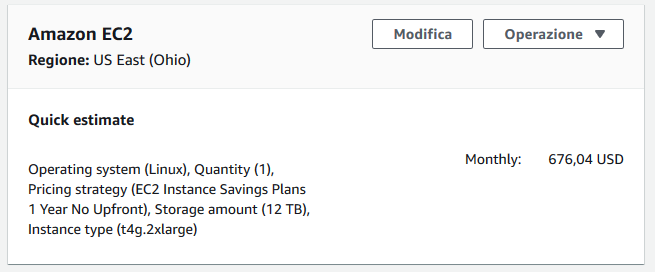

|  | On-premises | On cloud |
| :-: | :-: | :-: |
| Hardware | 2356€/year | ? |
| Software | 100000€/year | ? |

Migrating cluster to EMR:  ?
Given the software requirements, we need
  * 1 x Master Node (to manage the cluster)1 x Core node (with HDFS/EBS)
  * 4 x Task Nodes (to compute)

Image processing

4 Executors (2 cores and 10GB RAM each)

Driver (2 cores and 20GB RAM)

: 15m/core (2h total)

Weather processing

2 Executors (1 core and 500MB RAM each)

: 0.5 m/core (1m total)

Driver (1 core and 1GB RAM)

---

## On cloud v3

|  | On-premises | On cloud |
| :-: | :-: | :-: |
| Hardware | 2356€/year | 14710€/year |
| Software | 100000€/year | ? |

Migrating cluster to EMR:  14710€/year
  * S3 Infrequent Access storage (50 TB per month): 640€
  * 1 x Master EMR nodes, EC2 (m4.xlarge), Utilization (75 h/month): 4.5€
    * 75 h/month = 15min/task x 10task/day x 30day/month / 60min/hour
  * 1 x Core EMR nodes, EC2 (m4.xlarge), Utilization (75 h/month): 4.5€
  * 4 x Task EMR nodes, EC2 (m4.4xlarge), Utilization (75 h/month): 72€
  * 4 x EC2  on demand (task node): 174.83€
    * Storage amount (30 GB)
    * Workload (Daily, Duration of peak: 0 Hr 15 Min)
    * Instance type (m4.xlarge)
  * 2 x EC2 on demand (master and core nodes): 330€
    * Storage amount (30 GB)
    * Instance type (m4.xlarge)

|  | On-premises | On cloud |
| :-: | :-: | :-: |
| Hardware | 2356€/year | 13445€/year |
| Software | 100000€/year | ? |

Migrating cluster to EMR:  13445€/year
  * S3 Infrequent Access storage (50 TB per month): 640€
  * 1 x Master EMR nodes, EC2 (m4.xlarge), Utilization (75 h/month): 4.5€
    * 75 h/month = 15min/task x 10task/day x 30day/month / 60min/hour
  * 1 x Core EMR nodes, EC2 (m4.xlarge), Utilization (75 h/month): 4.5€
  * 4 x Task EMR nodes, EC2 (m4.4xlarge), Utilization (75 h/month): 72€
  * 4 x EC2  spot (task node): 69.55€
    * Storage amount (30 GB)
    * Workload (Daily, Duration of peak: 0 Hr 15 Min)
    * Instance type (m4.xlarge)
  * 2 x EC2 on demand (master and core nodes): 330€
    * Storage amount (30 GB)
    * Instance type (m4.xlarge)

[https://calculator.aws/---

##/estimate?id=c3780b12bb43b593d05def5a1d5218d9764b8a65](https://calculator.aws/---

##/estimate?id=c3780b12bb43b593d05def5a1d5218d9764b8a65)

---

## Migration

Summing up (cloud options)

| Machine uptime | Storage | Software | Feasible? | Cost per year |
| :-: | :-: | :-: | :-: | :-: |
| Constant | EC2 | Manual | YES: but high storage cost | ~36K€ |
| Constant | EC2 | EMR | YES: but high storage cost | ~37K€ |
| Constant | S3 | Manual | YES: but still manual provisioning | ~17K€ |
| Constant | S3 | EMR | YES | ~18K€ |
| Pay-per-use | EC2 | Manual | NO: pay-per-use + EC2 = Data unpersisted | - |
| Pay-per-use | EC2 | EMR | NO: pay-per-use + EC2 = Data unpersisted | - |
| Pay-per-use | S3 | Manual | ISH: repetitive manual provisioning | - |
| Pay-per-use | S3 | EMR | YES | ~14K€ |

Summing up
  * We estimated the cluster costs
    * On-premises solution with 18 machines: no go
    * Cloud solution with 18 EC2 instances: no go
  * We reduced the solution based on software requirements
    * On-premises solution with 4 machines: no go
    * Cloud solution with 4 EC2 instances: no go, we miss the software configuration
  * We moved the cluster to AWS EMR \+ spot instances \+ S3 storage
Can we do better?
  * Pick ad-hoc cloud services (AWS Lambda e AWS Batch)
  * ... to re-think the applications (food for thoughts)

---

## Case study

WeLASER

---

## The WeLASER project

**Project description**
  *The increased use of pesticides and fertilisers damages the environment, destroys non-target plants and beneficial insects for the soil and harms human and animal health. Most seeds develop herbicide-resistant properties, rendering pesticides ineffective. Mechanical automatic systems that are studied as alternatives to pesticides deteriorate soil features, damage beneficial soil organisms and offer limited results for in-row weeding. The EU-funded WeLASER project will develop a non-chemical solution for weed management based on pioneering technology consisting of the application of lethal doses of energy on the weed meristems through a high-power laser source. An AI-vision system separates crops from weeds, identifying the weed meristems and pointing the laser at them. A smart controller based on IoT and cloud computing techniques coordinates the system, which is transfered all over the field by an autonomous vehicle._

[https://cordis.europa.eu/project/id/101000256](https://cordis.europa.eu/project/id/101000256) (accessed 2020-08-01)

Which requirements do you foresee?
Can we define a tentative (service) architecture for the WeLASER project?
Assumptions
  * Do not consider the collection of weed/crop images & training/deploying of the CV algorithm

[https://cordis.europa.eu/project/id/101000256](https://cordis.europa.eu/project/id/101000256) (accessed 2020-08-01)

---

## Data sources

[https://docs.google.com/spreadsheets/d/17zEr62CzyqeIy0vU-DcjEUoxf6bMd3ziLSSeIXvk4Lg/edit?usp=sharing](https://docs.google.com/spreadsheets/d/17zEr62CzyqeIy0vU-DcjEUoxf6bMd3ziLSSeIXvk4Lg/edit?usp=sharing)

---

## Workload

Nothing special
  * Every night compute aggregated indexes on the collected data (2h/day)
On-premises (HDFS cluster)
  * How many machines do we need?
  * With which resources?

---

## On-premises

|  | On-premises | On cloud |
| :-: | :-: | :-: |
| Hardware | 2900€/year | ? |
| Software | 40000€/year | ? |

On-premises
  * How many machines do we need?
    * 4 :  1 master node  \+  3 HDFS data nodes
  * With which resources?
    * Assuming a HDFS replication factor of 3, we need at least 1TB of disk overall (not that much)
    * Think bigger: at least 8 cores, 64GB RAM, 500GB SSD \+ 4TB HDD, no GPU
  * 8700€ / 3 years = 2900€

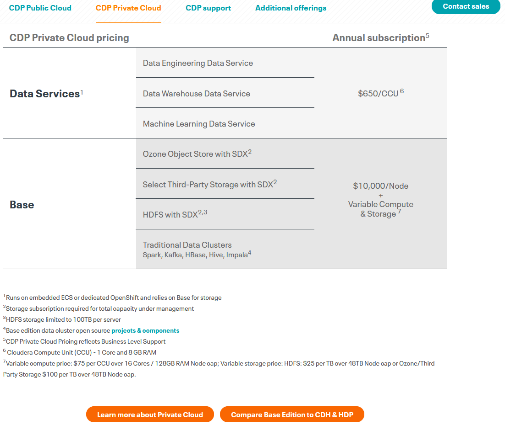

[https://www.rect.coreto-europe.com/en](https://www.rect.coreto-europe.com/en) (accessed 2022-09-01)[https://www.cloudera.com/products/pricing.html](https://www.cloudera.com/products/pricing.html) (accessed 2022-09-01)

---

## On cloud v1

|  | On-premises | On cloud |
| :-: | :-: | :-: |
| Hardware | 2900€/year | ~40000$/year |
| Software | 40000€/year | ? |

Moving the Hadoop cluster as IAAS
EC2
  * Quantity (4), Pricing strategy (EC2 Instance Savings Plans 3 Year No Upfront),  Storage amount (4 TB),  Instance type (r6g.2xlarge)
EMR
  * Number of master EMR nodes (1), EC2 instance (r5.2xlarge), Utilization (100 %Utilized/Month) Number of core EMR nodes (3), EC2 instance (r5d.2xlarge),  Utilization (100 %Utilized/Month)
MKS (KAFKA)
  * Storage per Broker (10 GB), Number of Kafka broker nodes (3), Compute Family (m5.2xlarge)

[https://calculator.aws/---

##/estimate?id=05965ca7de23fd9e7d2ab2cd0175fe8c01822c9c](https://calculator.aws/---

##/estimate?id=05965ca7de23fd9e7d2ab2cd0175fe8c01822c9c) (accessed 2022-09-01)

---

## On cloud v2

|  | On-premises | On cloud |
| :-: | :-: | :-: |
| Hardware | 2900€/year | ~4000$/year |
| Software | 40000€/year | ? |

Moving the Hadoop cluster as PAAS
EC2
  * Quantity (4), Pricing strategy ( On-Demand Instances ), Storage amount (30 GB), Instance type (r6g.2xlarge)
EMR
  * Number of master EMR nodes (1), EC2 instance (r5.2xlarge), Utilization (2 Hours/Day) Number of core EMR nodes (3), EC2 instance (r5d.2xlarge),  Utilization (2 Hours/Day)
S3
  * Standard storage (60 GB per month)
Kinesis
  * Days for data retention (1 days), Records (100 per second), Consumer Applications (3)

[https://calculator.aws/---

##/estimate?id=53f60ff0412a18877dc8e1274f7d9875aa3bf665](https://calculator.aws/---

##/estimate?id=53f60ff0412a18877dc8e1274f7d9875aa3bf665) (accessed 2022-09-01)

---

## Cost vs price

How would you evaluate the cost and the price?

Price  is the amount a customer is willing to pay for a product or service
Cost  is the expense incurred for creating a product or service
  * Hardware
  * Development
  * Maintenance
Profit  is the difference between price paid and costs incurred is profit
  * If a customer pays $10 for a product that costs $6 to make and sell, the company earns $4

---

## BIG DATA AND CLOUD PLATFORMS

---

## Amazon EMR

---

## EC2

AWS uses public-key cryptography to secure the login
You can create one using the Amazon EC2 console
  * Open the Amazon EC2 console at [https://console.aws.amazon.com/ec2/](https://console.aws.amazon.com/ec2/)
  * In the navigation pane, choose \`Key Pairs\`
  * Choose \`Create key pair\`
  * For \`Name\`, enter a descriptive name for the key pair
  * For \`File format\`, choose the format in which to save the private key
    * OpenSSH, choose \`pem\` (\` chmod 400   my-key-pair  .pe  m\`  )
    * PuTTY, choose \`ppk\`
  * Choose \`Create key pair\`
  * The private key file is automatically downloaded by your browser

---

## Creating the cluster

Choose the frameworks and applications to install
Data process
  * Submit jobs or queries directly to installed applications
  * Run steps in the cluster
Submitting jobs
  * Connect to the master node over a secure connection
  * Access the interfaces and tools that are available on your cluster

Using CLI (command line interface)
This is more pragmatic, but there are many options to explore
  * Let's stick to AWS Console
  * [https://console.aws.amazon.com/elasticmapreduce/](https://console.aws.amazon.com/elasticmapreduce/)

aws emr create-cluster \\
  * --name   "My First EMR Cluster"   \\
  * --release-label   emr-5.32.0   \\
  * --applications Name=Spark \\
  * --ec2-attributes KeyName=  myEMRKeyPairName   \\
  * --instance-type m5.xlarge \\
  * --instance-count 3 \\
  * --use-default-roles

Allows EMR to call other AWS Services such as EC2 on your behalf.

Provides access to other AWS services such as S3, DynamoDB from EC2 instances that are launched by EMR.

Using CLI (command line interface)

aws emr create-cluster --auto-scaling-role EMR\_AutoScaling\_DefaultRole --termination-protected --applications Name=Hadoop Name=Hive Name=Hue Name=JupyterEnterpriseGateway Name=Spark --ebs-root-volume-size 10 --ec2-attributes '\{"KeyName":"bigdata","InstanceProfile":"EMR\_EC2\_DefaultRole","SubnetId":"subnet-5fa2f912","EmrManagedSlaveSecurityGroup":"sg-07818b5690a50b3f1","EmrManagedMasterSecurityGroup":"sg-0e2f5550a2cb98f79"\}' --service-role EMR\_DefaultRole --enable-debugging --release-label emr-6.2.0 --log-uri 's3n://aws-logs-604905954159-us-east-1/elasticmapreduce/' --name 'BigData' --instance-groups '\[\{"InstanceCount":1,"BidPrice":"OnDemandPrice","EbsConfiguration":\{"EbsBlockDeviceConfigs":\[\{"VolumeSpecification":\{"SizeInGB":32,"VolumeType":"gp2"\},"VolumesPerInstance":2\}\]\},"InstanceGroupType":"MASTER","InstanceType":"m4.xlarge","Name":"Master - 1"\},\{"InstanceCount":1,"BidPrice":"OnDemandPrice","EbsConfiguration":\{"EbsBlockDeviceConfigs":\[\{"VolumeSpecification":\{"SizeInGB":32,"VolumeType":"gp2"\},"VolumesPerInstance":2\}\]\},"InstanceGroupType":"CORE","InstanceType":"m4.xlarge","Name":"Core - 2"\}\]' --scale-down-behavior TERMINATE\_AT\_TASK\_COMPLETION --region us-east-1

---

## Cluster lifecycle

Creating a cluster (it takes ~10 minutes)
  * A cluster cannot be stopped
  * It can only be terminated

STARTING: EMR provisions EC2 instances for each required instance
BOOTSTRAPPING: EMR runs actions that you specify on each instance
  * E.g., install custom applications and perform customizations
Amazon EMR installs the native applications
  * E.g., Hive, Hadoop, Spark, and so on
RUNNING: a step for the cluster is currently being run
  * Cluster sequentially runs any steps that you specified when you created the cluster
WAITING: after steps run successfully
TERMINATING: after manual shut down
  * Any data stored on the cluster is deleted

---

## Cluster: EMR

A step_is a user-defined unit of processing
  * E.g., one algorithm that manipulates the data
Step states
  * PENDING: The step is waiting to be run
  * RUNNING: The step is currently running
  * COMPLETED: The step completed successfully
  * CANCELLED: The step was cancelled before running because an earlier step failed
  * FAILED: The step failed while running

---

## Running the cluster

---

## Creating a notebook

---

## Hello, world!

---

## Add some storage

---

## Running a Spark Job

Connect using SSH

Install git

Clone & build the project

ssh -i ~/bigdata.pem [hadoop@ec2-54-242-176-32.compute-1.amazonaws.com](mailto:hadoop@ec2-54-242-176-32.compute-1.amazonaws.com)

sudo yum install git -y

git clone [https://github.com/w4bo/spark-word-count.git](https://github.com/w4bo/spark-word-count.git)

cd spark-word-count

./gradlew

spark-submit --class it.unibo.big.WordCount build/libs/WordCount-all.jar                     s3://aws-bucket-bigdata2021/inferno.txt

---

## Other services: HUE

Connecting to Hue
  * I.e., connecting to any HTTP interface hosted on the master node of a cluster
To view the Hue web user interface
  * Set Up an SSH Tunnel to the Master Node Using Dynamic Port Forwarding
  * Type the following address in your browser to open the Hue web interface
    * [http://master-public-DNS:8888](http://master-public-dns:8888/)
    * Where master-public-DNS is the public DNS name of the master node
  * If you are the administrator logging in for the first time
    * Enter a username and password to create your Hue superuser account
    * Otherwise, type your username and password and select Create account

---

## Set Up an SSH Tunnel

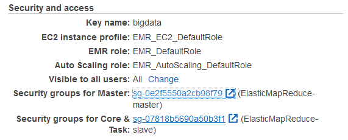

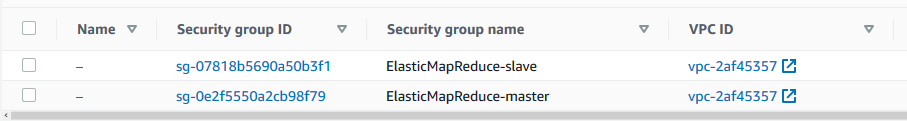

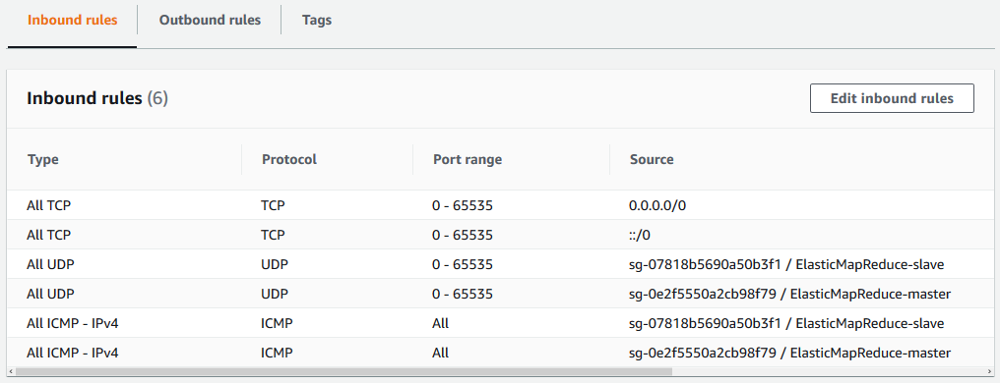

---

## Connect to HUE

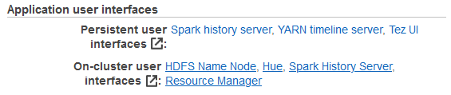

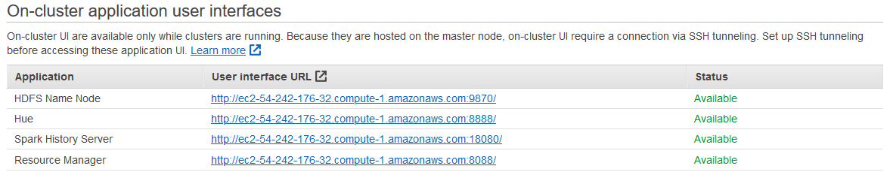

---

## Connect using SSH

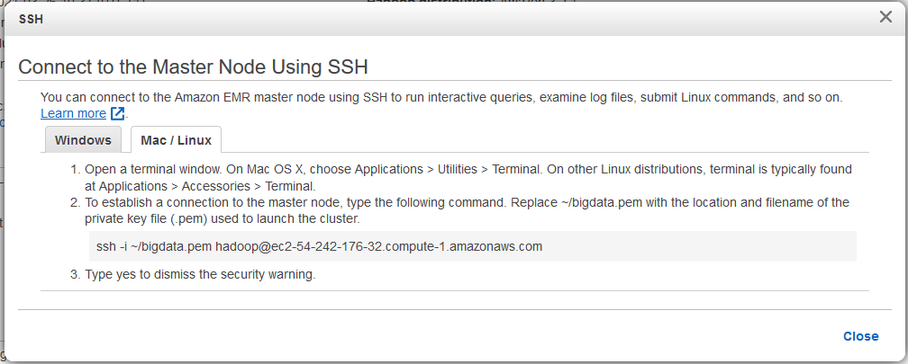

---

## 

---

## BIG DATA AND CLOUD PLATFORMS

---

## Hands on AWS

---

## AWS

Amazon Web Services (AWS) is a public-cloud platform
Services can be accessed in multiple ways
  * Web GUI: intuitive point and click access without any programming
    * Intuitive interfaces is part of the attraction of cloud services
    * Tedious if the same actions must be performed repeatedly
  * (REST) Application programming interface (API)
    * Permits requests to be transmitted via Hypertext Transfer Protocol (HTTPS)
  * Software development kits (SDKs) that you install on your computer
    * Access from programming languages such as Python, Java, etc.

---

## AWS Web console

We use the AWS Educate program
  * Login with the provided account
  * You got 150$ to work on AWS services
  * Provisioned services charge even if not used

[https://www.awseducate.com/signin/SiteLogin](https://www.awseducate.com/signin/SiteLogin)

---

## AWS CLI

CLI interface
  * Necessary to install the CLI (version 2)
  * See [https://docs.aws.amazon.com/cli/latest/userguide/install-cliv2.html](https://docs.aws.amazon.com/cli/latest/userguide/install-cliv2.html)

Synopsis

\*\*\*\*\*\*\*\*

aws \[options\] \<command> \<subcommand> \[parameters\]

Description

\*\*\*\*\*\*\*\*\*\*\*

A unified tool to manage your AWS services.

[https://docs.aws.amazon.com/cli/latest/userguide/install-cliv2-linux.html](https://docs.aws.amazon.com/cli/latest/userguide/install-cliv2-linux.html)

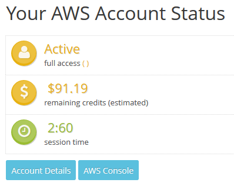

CLI needs credentials to work
  * Go back to AWS Educate
  * Click on "Account Details"
  * Copy the content into the file ~/.aws/credentials
  * Henceforth, we assume that you have set up the credentials file
  * Credentials expire after some time; you need a manually refresh

Run \`aws configure\`
  * Confirm AWS Access Key ID (press enter)
  * Confirm AWS Secret Access Key (press enter)
  * Set Default region name to \`us-east-1\`
  * Set Default output format to \`json\`
It is also possible to configure an AWS profile
  * A (named) profile is a collection of settings and credentials
  * If profile is specified, its settings and credentials are used to run a command
  * When no profile is explicitly referenced, use \`default\`
    * We stick to \`default\`

---

## Object storage: S3

Create S3 bucket, the following rules apply for naming buckets
  * Must be between 3 and 63 characters long
  * Can consist only of lowercase letters, numbers, dots (.), and hyphens (-)
  * Must be unique within a partition (i.e., a group of regions)

$ git clone [https://github.com/w4bo/bigdata-aws/](https://github.com/w4bo/bigdata-aws/)

$ cd bigdata-aws/lab01-lambda

$ aws s3api create-bucket --bucket aws-bucket-bigdata2021

$ aws s3 cp datasets/inferno.txt s3://aws-bucket-bigdata2021/inferno.txt

$ aws s3api list-objects --bucket aws-bucket-bigdata2021

[https://s3.console.aws.amazon.com/s3/home?region=us-east-1---

##](https://s3.console.aws.amazon.com/s3/home?region=us-east-1)

---

## BIG DATA AND CLOUD PLATFORMS

---

## Data pipelines on AWS Lambda

---

## Requirements

To start this lecture, you need to
  * Activate your AWS Educate account
  * Either
    * Install the necessary software
      * git
      * IntelliJ IDEA (with AWS Toolkit and Scala plugins)
      * python
      * java 1.8
      * Docker
      * AWS CLI, AWS SAM CLI
    * Be able to download and run the VM

---

## AWS SAM CLI

Serverless Application Model is a framework to build serverless applications
  * A serverless application is a combination of Lambda functions, event sources, etc.
  * Install AWS SAM CLI (on Linux)

sudo group add docker

sudo usermod –aG docker $USER

newgrp docker

sudo chmod 666 /var/run/docker.sock

wget [https://github.com/aws/aws-sam-cli/releases/latest/download/aws-sam-cli-linux-x86\_64.zip](https://github.com/aws/aws-sam-cli/releases/latest/download/aws-sam-cli-linux-x86_64.zip)

unzip aws-sam-cli-linux-x86\_64.zip -d sam-installation

sudo ./sam-installation/install

sam --version

[https://docs.aws.amazon.com/serverless-application-model/latest/developerguide/serverless-sam-cli-install.html](https://docs.aws.amazon.com/serverless-application-model/latest/developerguide/serverless-sam-cli-install.html)

---

## AWS services

AWS Educate (and AWS console)
  * [https://aws.amazon.com/it/education/awseducate/](https://aws.amazon.com/it/education/awseducate/)
  * [https://console.aws.amazon.com/console/home?region=us-east-1](https://console.aws.amazon.com/console/home?region=us-east-1)
IAM (authentication)
  * [https://docs.aws.amazon.com/IAM/latest/UserGuide/iam-ug.pdf](https://docs.aws.amazon.com/IAM/latest/UserGuide/iam-ug.pdf)
SDK (software API)
  * [https://docs.aws.amazon.com/sdk-for-java/latest/developer-guide/home.html](https://docs.aws.amazon.com/sdk-for-java/latest/developer-guide/home.html)
Lambda (serverless computing and processing)
  * [https://docs.aws.amazon.com/lambda/latest/dg/getting-started.html](https://docs.aws.amazon.com/lambda/latest/dg/getting-started.html)
  * [https://console.aws.amazon.com/lambda/home?region=us-east-1---

##/functions](https://console.aws.amazon.com/lambda/home?region=us-east-1---

##/functions)
DynamoDB (key-value database)
  * [https://docs.aws.amazon.com/amazondynamodb/latest/developerguide/Introduction](https://docs.aws.amazon.com/amazondynamodb/latest/developerguide/Introduction)
S3 (object storage)
  * [https://s3.console.aws.amazon.com/s3/home?region=us-east-1](https://s3.console.aws.amazon.com/s3/home?region=us-east-1)

---

## Case study

Given a dataset of sales per customer

find the products frequently bought together

Dataset sample

%%%%%%%%%%%%%%

\[ \{ customerName: Alice, products: \[Pizza, Beer, Diaper\] \},

\{ customerName: Bob, products: \[Pizza, Beer, Diaper\] \},

\{ customerName: Charlie, products: \[Pizza, Cola\] \} \]

The pipeline involves a single transformation
  * A classic mining problem, which one?

---

## Frequent itemset mining

Dataset sample

%%%%%%%%%%%%%%

\[\[Pizza, Beer, Diaper\],

\[Pizza, Beer, Diaper\],

\[Pizza, Cola\]\]

Find sets of items (i.e., itemsets) frequently appearing together
  * **Item**: a product
  * **Itemset**: a set of products
  * **Frequently**: support above threshold
  * **Support**: number of clients buying a set of products
Complexity: O(2|items|)

\{Pizza,Diaper,Beer\}

---

## Case study

Processed dataset sample

%%%%%%%%%%%%%%

\[\[Pizza, Beer, Diaper\],

\[Pizza, Beer, Diaper\],

\[Pizza, Cola\]\]

Raw dataset sample

%%%%%%%%%%%%%%

\[ \{ customerName: Alice, products: \[Pizza, Beer, Diaper\] \},

\{ customerName: Bob, products: \[Pizza, Beer, Diaper\] \},

\{ customerName: Charlie, products: \[Pizza, Cola\] \} \]

---

## Reference pipeline

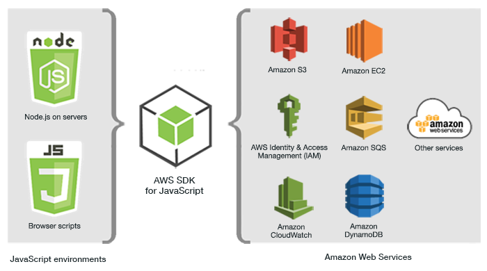

---

## NOSQL storage: DynamoDB

Basic DynamoDB components: tables and items
**Tables_, collection of (data) items
**Items_, a group of attributes that is uniquely identifiable
  * Each table contains zero or more items
    * No limit to the number of items you can store in a table
  * Each item in the table has a unique identifier, or primary key
  * E.g., in the table \`people\`, each item represents a \`person\`
    * The primary key consists of one attribute (\`fiscalCode\`)

Attributes
  * A data element that is not broken down any further
    * E.g., an item in the \`people\` table contains attributes \`fiscalCode\` and \`lastName\`
  * Most of the attributes are scalar (have only one value)
  * Some of the items have a nested attribute (\`address\`) up to 32 levels deep
Schemaless
  * Other than the primary key, a table is schemaless
    * Neither the attributes nor their data types need to be defined beforehand
    * Each item can have its own distinct attributes

Primary Key
  * To create a table, you must specify the primary key of the table
  * No two items can have the same key
Two types of primary keys
  * Partition key: a simple primary key composed of one attribute (partition key)
    * Keys are inputs to an internal hash function
    * The hash function determines the physical partition in which the item will be stored
    * E.g., access any item in the \`people\` table directly by providing the \`fiscalCode\`
  * Composite primary key: partition key and sort key (two attributes)
    * First attribute is the partition key
    * Second attribute is the sort key
    * Items in same partition key value are stored together and sorted by sort key

[https://docs.aws.amazon.com/amazondynamodb/latest/developerguide/bp-gsi-overloading.html](https://docs.aws.amazon.com/amazondynamodb/latest/developerguide/bp-gsi-overloading.html)

Secondary Indexes
  * One or more secondary indexes per table
  * Indexes are automatically maintained on add, update, or delete
  * Query data using an alternate key (additionally to queries against primary key)
Two types of indexes
  * Global secondary has partition and sort keys different from those on table
  * Local secondary has the same partition key but a different sort key
  * Each table has a limited quota of 20 global and 5 local indexes
How do we shape the schema?
  * [https://cloud.google.com/bigtable/docs/schema-design](https://cloud.google.com/bigtable/docs/schema-design)

Create a table \`frequent-sales\` with a composite key
  * \`dataset\`: String
  * \`timestamp\`: String

$ aws dynamodb create-table \\

--table-name frequent-sales \\

--attribute-definitions AttributeName=dataset,AttributeType=S AttributeName=timestamp,AttributeType=S \\

--key-schema AttributeName=dataset,KeyType=HASH AttributeName=timestamp,KeyType=RANGE \\

--provisioned-throughput ReadCapacityUnits=1,WriteCapacityUnits=1

$ aws dynamodb list-tables

$ aws dynamodb delete-table --table-name frequent-sales

Reading data from DynamoDB might not reflect the results of a recent write
Eventually Consistent Reads (default)
  * Response might include stale data
  * After short time, the response should return the latest data
Strongly Consistent Reads
  * Response includes the most up-to-date data
  * A strongly consistent read might not be available if there is a network delay or outage
    * In this case, DynamoDB may return a server error (HTTP 500)
  * Strongly consistent reads may have higher latency than eventually consistent reads
  * Strongly consistent reads are not supported on global secondary indexes

Provisioned mode: specify the ---

##reads and ---

##writes per second
  * You have predictable application traffic or traffic ramps gradually
  * You can forecast capacity requirements to control costs
One read capacity unit
  * One strongly consistent read per second, two eventually consistent reads per second
  * RCUs also depend on the item size (a read is up to 4 KB in size), if item size is 8 KB
    * 2 RCUs to sustain one strongly consistent read per second
    * 1 RCU if you choose eventually consistent reads
One write capacity unit represents one write per second for an item up to 1 KB in size

Put a new item and get it back

$ aws dynamodb put-item    --table-name frequent-sales    --item '\{"dataset": \{"S": "sales"\}, "timestamp": \{"S": "1611226870"\}, "bar": \{"S": "foobar"\}\}'

$ aws dynamodb query    --table-name frequent-sales    --key-condition-expression "dataset = :n"     --expression-attribute-values '\{":n":\{"S":"sales"\}\}'

---

## Lambda: create a function

[https://console.aws.amazon.com/lambda/home?region=us-east-1---

##/functions](https://console.aws.amazon.com/lambda/home?region=us-east-1---

##/functions)

---

## Lambda: attaching a role

---

## Lambda: create a function

[https://console.aws.amazon.com/lambda/home?region=us-east-1---

##/functions](https://console.aws.amazon.com/lambda/home?region=us-east-1---

##/functions)

Manually creating the functions is cumbersome
  * We must copy and paste code
  * No automatic testing
  * No debugging
  * No IDE support (and not all languages are supported)
Switch to IntelliJ IDEA \+ AWS Toolkit

---

## AWS Toolkit

  * Get the latest IntelliJ IDEA
  * Install the \`AWS Toolkit\`
  * Copy the credentialscp ~/.aws/credentials ~/.aws/config
  * Clone the repo git clone [https://github.com/w4bo/bigdata-aws/](https://github.com/w4bo/bigdata-aws/)
  * Import \`lab01-lambda\` as a Gradle project
  * Verify that the project builds./gradlew

Click on \`AWS Explorer\`
  * You can see the \`helloworld\` function
  * Plus \`CloudWatch Logs\` and \`S3\`

Test the existing code locally
  * With Gradle
  * Or with local Lambda execution
Deploy a new Lambda function from the existing code
  * Right click on AWS Explorer > Lambda
  * Select \`Create new AWS Lambda…\`
  * Populate the settings
  * \`Create the function\`

[https://aws.amazon.com/lambda/pricing/](https://aws.amazon.com/lambda/pricing/)

Check the log for errors and pricing
  * AWS Toolkit > CloudWatch Logs
  * Double click on the function name
  * Double click on the log entry

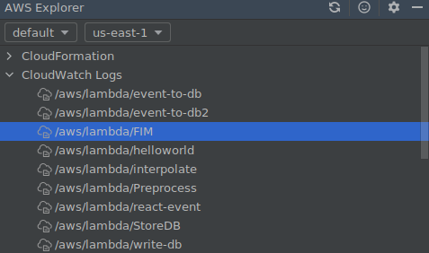

---

## Data pipeline

Deploy and execute the HelloWorld.java lambda function
Given the created storage: S3 and DynamoDB
  * Deploy the function \`FIM\`
  * Deploy the function \`Preprocess\`
  * Run \`ReadDataset.java\`
  * Check that the table \`frequent-sales\` has the FIs for the dataset \`sales\`
Some hints
  * Function names are case sensitive
  * Some function need more than 128MB of memory
    * Behold\! The higher the RAM, the higher the costs

---

## 

